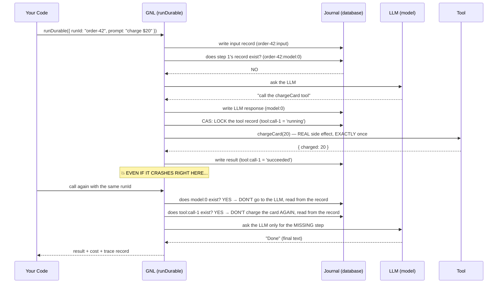
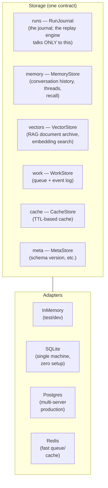
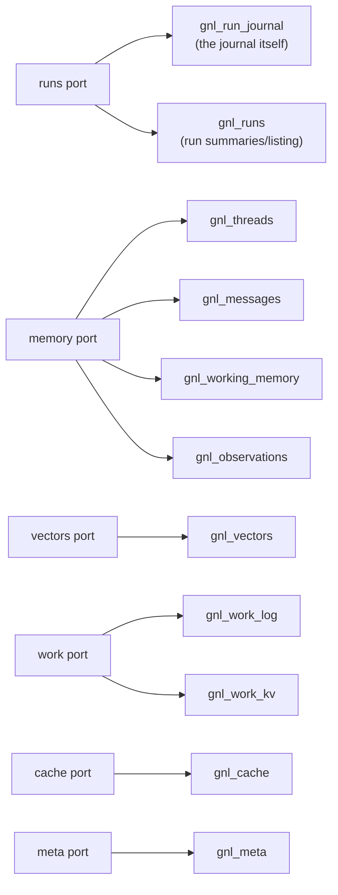
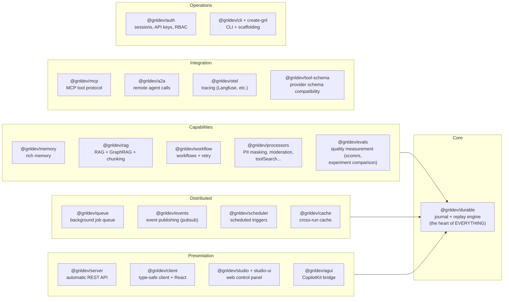
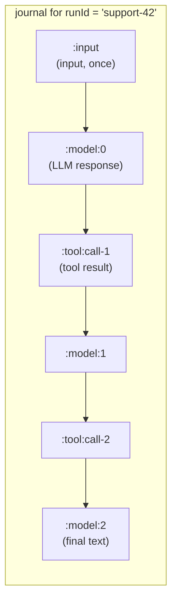
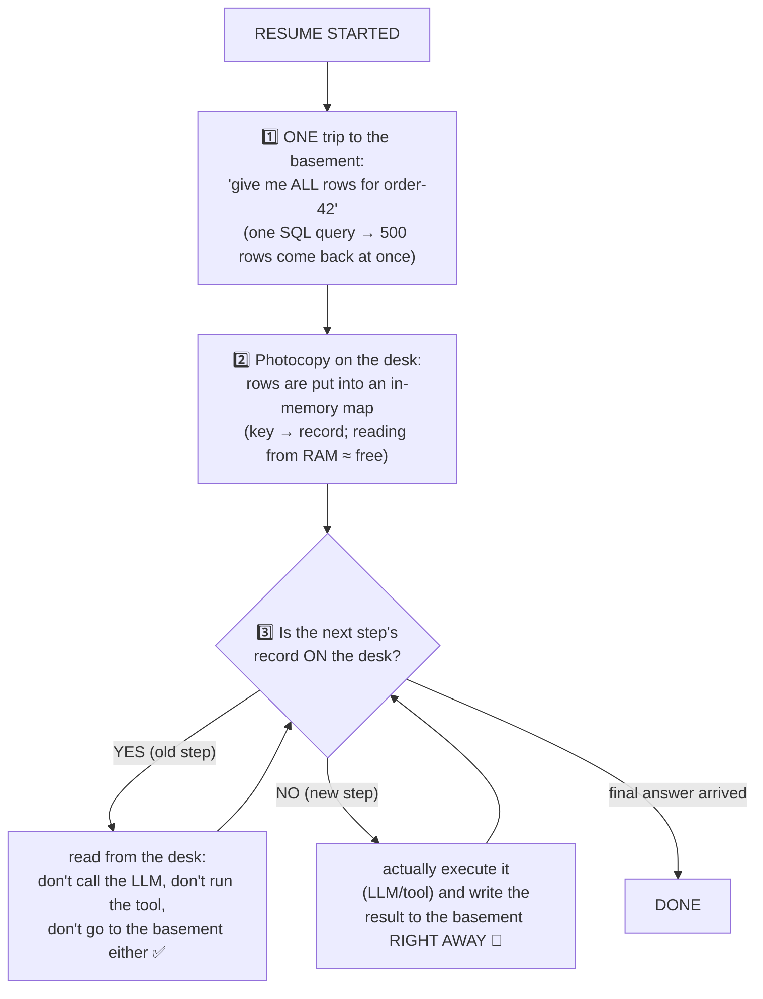
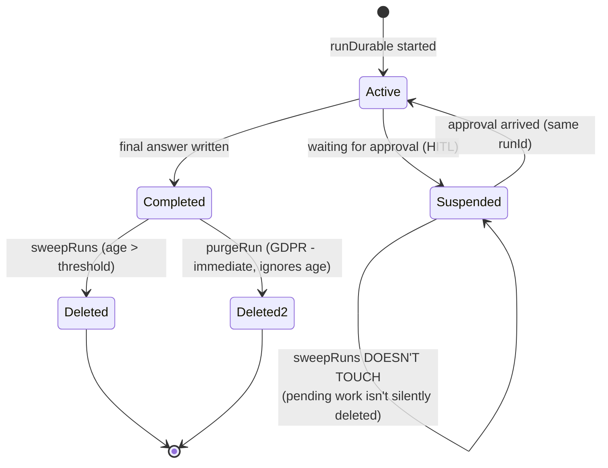
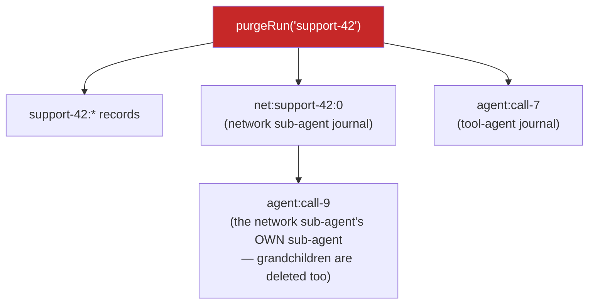
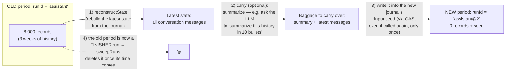
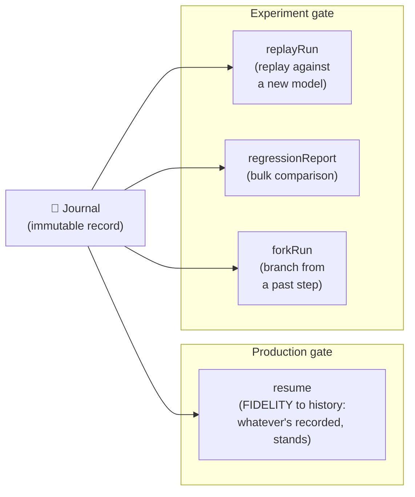

# gnl — The Complete Guide: What It Is, How It Works, Why It's Different

> This document is written for someone who **has never heard of GNL**. Technical terms are
> explained in parentheses the first time they appear. Diagrams are in Mermaid format
> (GitHub/VS Code render them automatically).

---

## 1. What is GNL? (in one paragraph)

GNL is a TypeScript framework (framework: a code library set that provides the skeleton of your
application) for building **AI agents** (agent: an LLM — a language model like ChatGPT — performing
multi-step work using tools). Its core difference from other agent frameworks is this: **in GNL,
every agent run is written to a "journal," so even if the power goes out, the server crashes, or
the process dies mid-execution, the agent picks up exactly where it left off — and irreversible
operations like charging a card or sending an email NEVER run twice.**

---

## 2. The problem it solves: "What happens if an agent dies halfway through?"

Picture an agent: it charges $20 from a customer's card, then sends an invoice email, then leaves
a note in the CRM (customer relationship system). Three steps, three **side effects** (side effect:
an operation that changes the outside world and cannot be undone).

Scenario: card charged ✅ → email sent ✅ → **server crashes** 💥 before the CRM note is written.

Now what?

- **If you restart from scratch:** the card is charged a SECOND time, the email goes out a SECOND
  time. Disaster.
- **If you don't run it at all:** the CRM note is missing. The job is half-done.

Most frameworks don't fully answer this question. GNL's answer:

```
Re-run the agent with the SAME runId.
→ Card charge: found in the journal → SKIPPED (not charged again, the recorded result is used)
→ Email:       found in the journal → SKIPPED
→ CRM note:    never started → runs now ✅
```

This is **deterministic replay**: the same run repeated reconstructs the same outcome from the
journal's records, without going back to the LLM or the tools. Steps that finished are skipped;
steps that never began run.

### The case that sentence quietly skipped

The crash above lands *between* steps, which is the easy half. The hard half is a crash **inside**
one — the CRM write goes out, and the process dies before its result reaches the journal. Resume
now faces a step it cannot classify: it may have happened, it may not.

GNL does not guess in either direction. For a tool that has side effects it **blocks and asks**,
throwing `SideEffectRetryBlockedError`:

```ts
import { SideEffectRetryBlockedError } from '@gnldev/durable';

try {
  await runDurable({ runId: 'order-42', journal, model, tools, prompt });
} catch (e) {
  if (!(e instanceof SideEffectRetryBlockedError)) throw e;
  // e.detail.key names the call in doubt. Resolve it one of three ways:
  //   1. tool.recover()  — re-check the provider; returns {done:true, output} or {done:false}
  //   2. tool.idempotent: true — safe to repeat, so just repeat it
  //   3. approvals: { [toolCallId]: true } — a human decided
}
```

So the honest name for the guarantee is **at-most-once**: a side effect never runs twice, and where
the framework cannot tell, it stops rather than risk it. That is a deliberate trade — correctness
over seamlessness — and it is why the resume is not always invisible. **This is GNL's "moat"**
(a moat: a structural advantage that is hard to copy without making the same design bet).

Every tool is treated as side-effecting unless it says otherwise (`durable-tool.ts`:
`tool.sideEffect ?? tool.idempotent !== true`), so this is the default path, not an edge case.

---

## 3. Core concept glossary

| Term | Explanation |
|---|---|
| **LLM** | Large language model — a text-generating AI like GPT, Claude, or Gemini. |
| **Agent** | LLM + tools + loop: the model says "call this tool," the result goes back to the model, the model continues — until the answer is done. |
| **Tool** | A function the agent can call: a weather API, a database query, a card charge... |
| **Run** | A single agent processing one task from start to finish. Every run has a unique `runId`. |
| **Journal** | The heart of GNL: EVERY LLM response and EVERY tool result in a run is written to the database as a key-value pair. It is append-only — only additions, never modifications. |
| **Replay** | When called again with the same `runId`, GNL reads the journal: recorded steps are returned from the record without re-executing, and only missing steps actually run. |
| **Resume** | Restarting a run with the same `runId` after a crash/interruption — thanks to replay, it continues right where it left off. |
| **CAS** | Compare-And-Set: performing "write this key only if it's EMPTY, don't touch it if it's already set" as a SINGLE atomic step in the database engine. Even if two servers try to write at the same time, only ONE wins. The technical foundation of exactly-once. |
| **Idempotent** | An operation that produces the same result whether called once or ten times (e.g., "don't create a new record if one already exists with this id"). |
| **HITL** | Human-in-the-loop: the agent pauses before a risky operation and waits for human approval. |
| **RAG** | Retrieval-Augmented Generation: a technique that first retrieves documents relevant to a question from an archive, then feeds them to the LLM as context. |
| **Embedding** | A numeric vector representing the meaning of a piece of text; the "semantic closeness" of two texts is measured using these numbers. |
| **Workflow** | Unlike an agent's free-form loop, a process whose steps YOU define, sequential or branching (step 1 → step 2a or 2b depending on a condition → ...). |
| **Multi-tenant** | Isolating the data/budget of multiple customers from each other within a single deployment. |

---

## 4. How does a run work, step by step?



Critical details:

1. **The lock is written BEFORE the tool call** (a `'running'` marker via CAS): even if two servers
   process the same run at the same time, only one can execute the tool — the card is never charged
   twice. This is proven with live tests (see the "Proof" section below).
2. **LLM responses are also written to the journal**: on resume, the LLM is never called again →
   this preserves both the same decision (determinism) and the token cost (LLM usage fee), which
   isn't paid again.
3. **Approval (HITL)**: if a tool is marked with a `guard` (guard: a rule that specifies which tool
   requires approval), the run is SUSPENDED there; once human approval arrives, it continues with
   the same `runId`.

---

## 5. Database structure — what does the "journal" look like inside?

### 5.1 Key schema (every record is a key-value pair)

| Key | Content |
|---|---|
| `<runId>:input` | The run's input (question/messages/system instructions) — so resume is self-sufficient. |
| `<runId>:model:<N>` | The Nth LLM response (text + tool-call requests + token counts). |
| `<runId>:tool:<callId>` | The state of a tool call: `running` → `succeeded/failed/denied/suspended` + output. |
| `<runId>:cfg:model` | The WINNING model in the model fallback chain (fallback: switching to a backup if the primary model fails) — the run "sticks" to the same model throughout. |
| `<runId>:proc:<name>` | The frozen result of non-deterministic intermediate decisions (LLM-based moderation, scoring...). |
| `<runId>:wf:<stepId>` | Workflow step outputs. |
| `<runId>:net:route:<i>` / `net:step:<i>` | In a dynamic agent network (below), router decisions + step results. |
| `<runId>:lock` | The run lock (prevents two servers from processing the same run at once). |
| `agent:<callId>` / `net:<runId>:<i>` | Sub-agents' OWN journals (each sub-agent is a full-fledged run). |

### 5.2 Storage architecture: 6 "ports," 4 adapters

GNL never connects to a database directly; it talks through an abstract interface (interface: a
"these functions will exist" contract) called **Storage**. This interface is split into 6 ports:



No adapter is REQUIRED to support every port — the **capability matrix** honestly states what it
can offer, and with `composite()` (combinator), ports can be distributed across different engines:

```ts
// Example: run journal on Postgres (durability), queue+cache on Redis (speed):
const storage = composite({
  default: new PostgresStorage({ connectionString: PG_URL }),
  overrides: { work: redis, cache: redis }, // redis = new RedisStorage({...})
});
```

| Adapter | runs (journal) | memory | vectors | work | cache | When? |
|---|---|---|---|---|---|---|
| InMemory | ✅ | ✅ | ✅ | ✅ | ✅ | Testing, prototyping. |
| SQLite | ✅ | ✅ | ✅ | ✅ | ✅ | Single machine, zero setup (built into Node). |
| Postgres | ✅ | ✅ | ✅ (with pgvector) | ✅ | ✅ | Multi-server production. **Recommended journal.** |
| Redis | ✅* | ❌ | ❌ | ✅ | ✅ (real TTL) | Queue/cache accelerator. *Not recommended for the journal in failover setups (see below). |

### 5.3 Concrete table structures — which table is used for what, and when?

The SQLite and Postgres adapters create **12 tables** with identical names on first startup
(`init()` — idempotent: if a table exists, it's left untouched). How the ports map to tables:



**① `gnl_run_journal` — the journal itself (the most important table).**

| Column | Purpose |
|---|---|
| `key` | The key from §5.1 (e.g., `order-42:model:0`) — the primary key (primary key: the column that makes a row unique; the SAME key can't be inserted a SECOND time — CAS relies on this constraint). |
| `run_id` | Which run this belongs to (extracted from the key and stored separately — so "all rows for this run" queries are fast via an index). |
| `kind` | Row type: `model` (LLM response) or `tool` (tool result). |
| `value` | The record itself — JSON text (superjson: a JSON variant that also preserves types like `Date`). |
| `suspended` | A flag: "is this row a tool call waiting for approval?" — pre-extracted so the approval-queue screen can find it without opening the full value. |
| `created_at` | Write timestamp (milliseconds) — row ORDER during replay is reconstructed from this. |

*When?* One row is WRITTEN per LLM/tool step; at the start of resume, ALL rows for the run are
READ in a SINGLE query (see §11.2). Atomicity lives directly in SQL: `INSERT ... ON CONFLICT DO
NOTHING` ("insert if not exists" — if two servers write the same key, the engine allows only
one = CAS).

**② `gnl_runs` — the run listing.** Columns: `run_id, model_steps (how many LLM steps),
tool_calls (how many tools), suspended (is it pending), created_at/updated_at`. *Why does it
exist?* For Studio's "Runs" list: instead of scanning millions of journal rows to list 10,000
runs, one summary row per run is read. Automatically updated on every journal write (it's derived
data — even if it gets corrupted, it can be recomputed from the journal).

**③ `gnl_threads` — conversation headers.** Columns: `id, resource_id (which USER's conversation
— multi-user separation), title, parent_thread_id (a conversation branched off another),
metadata, created/updated_at, deleted_at (deletion flag)`. *When?* If you're using memory
(`threadId`); the user's conversation-list screen comes from here.

**④ `gnl_messages` — conversation messages, one row per message.** Columns: `thread_id + seq
(sequence number — together they form the primary key: two messages can't be written to the
same sequence → no duplicates on concurrent inserts), role (user/assistant), text (searchable
plain text), embedding (semantic search vector — this is what "recall" uses), ts (timestamp),
message (the raw/full form of the message)`. *When?* Added here once a run completes; loaded
from here in subsequent runs for history, and semantic recall searches here.

**⑤ `gnl_working_memory` — the agent's "scratch note."** A SINGLE row per conversation/user
(`scope_id → data`): the running summary the agent keeps for itself ("customer's name is Ali,
order #42..."). Unlike the journal, this IS overwritten — because it's not a record, it's a
current-state note.

**⑥ `gnl_observations` — distilled observations.** Persistent notes the agent extracts from
conversations ("user prefers formal language"). One row per thread, containing a list of
observations.

**⑦ `gnl_vectors` — RAG document archive.** Columns: `id (chunk identifier, e.g., 'handbook#3'),
text (the chunk's text), embedding (meaning vector), metadata (source/title trail), created_at`.
*When?* Populated via `indexDocuments`; every time the agent uses the knowledge-base tool, the
"K chunks closest to the question" are searched here. If Postgres has the pgvector extension,
the search happens inside the engine (via a fast index).

**⑧ `gnl_work_log` — queue/event log.** Columns: `ns (namespace — which queue/topic, e.g.,
'evt:order'), id (record id; ns+id is the primary key → the same event CANNOT be inserted twice
= idempotent publishing), payload (content), ts`. *When?* When `@gnldev/queue` adds a job, when
`@gnldev/events` publishes an event. Append-only; old entries are swept with `sweepLog`.

**⑨ `gnl_work_kv` — queue management notes.** Free-form key-value: job status, scheduler
definitions, and most importantly **ack markers** (ack marker: "consumer Y received event X" —
written via CAS → the same event can't be delivered to the same consumer TWICE).

**⑩ `gnl_cache` — TTL-based cache.** `key, value, expires_at`. For reuse ACROSS runs (e.g., the
embedding of the same text across two runs → compute it once). Expired entries aren't read and
get cleaned up.

**⑪ `gnl_meta` — system metadata.** `k → v` (e.g., `schema_version = 3`): checked by the adapter
on startup; if the table schema is from an older version, it decides the safe migration path
from here.

> To remember it easily: **① the journal, ② the listing, ③–⑥ memory, ⑦ the library, ⑧–⑨ the
> mailroom, ⑩ the fridge, ⑪ the ID card.** The critical guarantee lives only in ①; the rest are
> comfort/speed layers and can be moved to other engines with `composite()`.

---

## 6. Package map — 24 packages, 6 groups



Key point: **every package is built on top of `@gnldev/durable`** — a RAG query, a queue job, a
remote agent call are all automatically written to the journal and INHERIT the exactly-once
guarantee. In competing frameworks these features exist individually, but there's no shared
durability foundation.

---

## 7. Full usage walkthrough — from zero to production

### 7.1 Your first agent (5 minutes)

```ts
import { createGnl, InMemoryJournal } from '@gnldev/durable';
import { openai } from '@ai-sdk/openai';

const gnl = createGnl({
  journal: new InMemoryJournal(),           // in prod: new SqliteStorage('app.db').runs
  agents: {
    assistant: {
      model: ['openai/gpt-4o', 'anthropic/claude-sonnet-4'], // FALLBACK CHAIN: if the first fails, use the second
      system: 'Answer briefly and clearly.', // system instructions (the agent's personality/rules)
    },
  },
});

const r = await gnl.run('assistant', { runId: 'question-1', prompt: 'Hello!' });
console.log(r.text);
```

Passing an array to `model` activates **deterministic fallback**: the first model that succeeds
gets "frozen" into the journal, and the rest of the run and all resumes use the SAME model (in
many other frameworks, the fallback decision isn't persistent — a resume can produce a different
answer with a different model).

### 7.2 Tools + human approval (HITL)

```ts
const gnl = createGnl({
  journal,
  agents: {
    cashier: {
      model: 'openai/gpt-4o',
      tools: { chargeCard: tool({ /* charge the card */ }) },
      guard: { requireApproval: ['chargeCard'] },  // this tool requires HUMAN APPROVAL
    },
  },
});

const r1 = await gnl.run('cashier', { runId: 'payment-7', prompt: 'charge $20' });
// r1.interrupts → [{ toolCallId: 'call-1', toolName: 'chargeCard', args: {...} }]  → SUSPENDED

// ... a human approved it from Studio (or your own UI) ...
const r2 = await gnl.run('cashier', {
  runId: 'payment-7',                            // SAME runId = continue
  approvals: { 'call-1': true },
});
// The LLM was not called again, and the card was charged EXACTLY once.
```

### 7.3 Memory (conversation history)

```ts
import { AgentMemory } from '@gnldev/memory';
const gnl = createGnl({ storage, memoryFactory: (s) => new AgentMemory({ storage: s, embed }) });
await gnl.run('assistant', { runId: 'r1', threadId: 'customer-5', prompt: 'My name is Ali' });
await gnl.run('assistant', { runId: 'r2', threadId: 'customer-5', prompt: 'What was my name?' }); // "Ali"
```
Runs sharing the same `threadId` (conversation thread identifier) share history; **semantic
recall** (finding past messages relevant to the current question via embeddings) and **working
memory** (the running summary the agent keeps for itself) are both supported.

**Write-ahead persistence.** The user's message is written to the thread *before* the first model
call; the assistant's answer is appended at completion. A run that fails before its first token
(provider outage, quota) therefore never loses the question — the thread shows what was asked, and
a retry (same `runId` or a fresh one re-sending the same text) is deduplicated instead of doubling
the message. A turn suspended for approval likewise shows its question while it waits.

**Client contract (delta-only).** With memory active, the server owns the history: send only the
*new* message(s) per turn — not the whole transcript. Clients that POST their full history anyway
(the `useChat` wire format does this) are handled: once a thread has stored history, assistant/tool
messages inside the request can only be echoes of earlier server turns and are trimmed before
persisting and prompting. Seeding a *new* thread with a prepared transcript (few-shot history on the
first turn) still persists wholesale.

**Memory provenance (why did the model know that?).** Every memory-enabled turn freezes a `:memctx`
record next to its input: which messages semantic recall injected (with their similarity scores),
the recent-window messages themselves, working-memory/observation injections, and how many
client-echoed messages were trimmed. The frozen input says *what* the model saw; this record says
*where each part came from* — read it via `GET /runs/:id/memory-context`, or in Studio's Inspector:
Threads → a conversation → a turn's **memory** row. Unanswered questions (a run that died before its
first token) appear in the same ledger as ghost rows.

**Counterfactual replay (prove it, don't infer it).** "The model must have read it from the recall
snippet" is an inference — Studio's Regression tab can turn it into an experiment: *re-run without
memory* strips exactly what the provenance record proves was injected and re-asks the same turn with
the same model, then diffs the answers. It refuses to run on turns without a provenance record
rather than guessing what to strip.

### 7.4 RAG — answering from a document archive

```ts
import { chunkDocuments, PostgresVectorStore, createRagTool, GraphRag } from '@gnldev/rag';

// 1) Split documents into chunks (chunk: breaking long text into small, searchable pieces):
const chunks = chunkDocuments([{ id: 'handbook', text: longText }], { strategy: 'markdown' });
// 2) Write to a persistent vector store (pgvector: Postgres's embedding search extension):
const store = new PostgresVectorStore({ connectionString: PG_URL });
await indexDocuments(store, embed, chunks);
// 3) Give it to the agent as a tool:
tools: { knowledgeBase: createRagTool({ store, embed, topK: 4 }) }
```
Fine detail: since the RAG query is also written to the journal, **the search isn't repeated on
resume** — even if new documents are added to the archive in the meantime, the run continues with
the same evidence (deterministic RAG — rare, because it requires the retrieval itself to be journaled). `GraphRag` builds a
similarity graph between chunks and also finds **indirectly related** chunks.

### 7.5 Multi-agent — static and dynamic

```ts
// STATIC: the parent agent sees sub-agents as tools (agent-as-tool):
agents: {
  manager: { model, agents: ['researcher', 'writer'] },   // agent_researcher, agent_writer tools
  researcher: { model, description: 'does web research' },
  writer: { model, description: 'writes text' },
}

// DYNAMIC NETWORK: a router LLM decides FOR ITSELF which agent runs each turn:
networks: {
  support: { router: 'openai/gpt-4o-mini', agents: ['researcher', 'writer'], maxIterations: 6 },
}
const result = await gnl.runNetwork('support', { runId: 'ticket-9', task: 'Research and summarize topic X' });
```
GNL's difference: routing decisions are also **frozen into the journal via CAS** → on resume, the
router isn't called again, and the network follows the same path. If a sub-agent suspends for
approval, the interruption propagates upward. Studio's `GET /runs/:id/network` shows a visual of
the tree.

### 7.6 Workflow — controlled processes + retry

```ts
import { workflow, step, retry } from '@gnldev/workflow';

const wf = workflow<Order>()
  .then(retry(step('stockCheck', check), { attempts: 3, backoffMs: 500, fallback: step('manual', enqueue) }))
  .branch((s) => s.amount > 1000, step('managerApproval', approve), step('autoApproval', pass))
  .foreach((s) => s.items, (item) => prepare(item));

await wf.run(order, { runId: 'wf-42', journal });
```
Every step is written to the journal → if the process crashes midway, completed steps are
skipped. Even `retry`'s attempt counter lives in the journal: after a crash, the "3 attempts
allowed" budget isn't reset.

### 7.7 Quality measurement (evals)

```ts
import { faithfulness, toxicity, createDatasetsManager } from '@gnldev/evals';

// Automatic end-of-run scoring: agents.assistant.scorers = [toxicity({ model: judge })]
// Experiment comparison:
const m = createDatasetsManager(journal);
await m.runExperiment({ dataset, run: withOldModel, scorers, experimentId: 'v1' });
await m.runExperiment({ datasetId: dataset.id, run: withNewModel, scorers, experimentId: 'v2' });
const diff = await m.compare(dataset.id, 'v1', 'v2');  // which questions regressed, which improved
```
If the suite crashes midway, completed test cases are skipped (**resumable evals** — uncommon, because it needs the eval run to be journaled like any other
don't have this); LLM-judge scores are also written to the journal, so repeated runs return the
same score (and no money is burned again).

### 7.8 Server, client, Studio

```ts
// Server: turns the CONFIG (not the registry instance) into an automatic REST API + OpenAPI schema.
import { createRestApi } from '@gnldev/server';
import { serve } from '@hono/node-server';
const api = createRestApi(config);              // the same object you passed to createGnl
serve({ fetch: api.fetch, port: 3000 });        // POST /agents/assistant/run, SSE stream, /metrics...

// Client (browser/React):
import { GnlClient } from '@gnldev/client';
const client = new GnlClient({ baseUrl: 'http://localhost:3000' });
await client.run('assistant', { runId: 'order-42', prompt: '...' });
// runId is optional — omit it and the client generates one, which means a retry is a NEW run and
// gets no exactly-once protection. Pass your own whenever the call has a side effect.

// Studio: web control panel — npx @gnldev/studio --db runs.db
// (or --config gnl.config.ts, which also serves the Playground; it needs one or the other)
// 18 views: run timeline, TIME-TRAVEL (jump back to a past step and FORK from there),
// approval queue, cost, traces, tenant/budget management, network tree, playground...
```

### 7.9 Deployment and observability

There is no deployment package, and that is the design: `createRestApi()` returns a web-standard
`fetch` handler, so what runs it is whatever your platform already expects. No adapter in between,
nothing to keep in step with a provider's API.

```ts
import { createRestApi } from '@gnldev/server';
const api = createRestApi(config);

// Node — bring any server that speaks fetch handlers
import { serve } from '@hono/node-server';
serve({ fetch: api.fetch, port: Number(process.env.PORT ?? 3000) });

// Cloudflare Workers, Deno Deploy, Bun — the handler *is* the module's default export
export default { fetch: api.fetch };
```

```ts
import { exportRunToOtlp, otlpPresets } from '@gnldev/otel';
await exportRunToOtlp(journal, 'order-42', otlpPresets.langfuse({ publicKey, secretKey }));
// the run's full trace to Langfuse (an LLM tracing service) in a single line
```

### 7.10 Maintenance: cleanup and long-lived agents

```ts
await sweepRuns(journal, { olderThanMs: 30 * DAY });   // delete old runs (suspended ones are preserved)
await purgeRun(journal, 'order-42');                    // GDPR: delete ALL traces of a run
                                                        // (including sub-agent journals — recursively)
const { newRunId } = await rolloverRun(journal, 'main-assistant');  // for an agent that's been
// running for weeks and whose journal has grown → move its state to a new "period," delete the old one later
```

---

## 8. Design trade-offs — what GNL does, and what it deliberately doesn't

Every framework spends its complexity budget somewhere. GNL spends nearly all of it on one thing:
**a run that can be replayed, audited and resumed without repeating a side effect.** That choice
buys the first list and costs the second.

**What the budget bought**

| Capability | What it means in practice |
|---|---|
| **Exactly-once side effects** | A tool call that already ran is never charged twice — enforced with CAS, verified across two OS processes and against real Postgres/Redis in CI |
| **Deterministic replay** | The same run reconstructs to the same result without calling the model again — the model's response is in the journal, not just the state |
| **Time-travel + fork** | Jump to any past step and branch from there, visually in Studio |
| **Model fallback is persistent** | The model that actually won is written to the journal; a resume sticks with it instead of re-rolling the dice |
| **Dynamic agent-network decisions are frozen** | A routing decision made once is recorded, so a replay follows the same path |
| **Resumable evals** | A test suite continues where it stopped instead of starting over |
| **Governance surface** | Studio ships 18 views: approval queue, policy, budget, audit, regression comparison |
| **Edge-native** | A thin core with optional dependencies, small enough to run inside a Workers-class bundle |

**What it cost — deliberately, not by omission**

| Not here | Why |
|---|---|
| Voice (TTS/STT), Slack/WhatsApp channels | Out of scope. These are integration surface, not durability; adding them would widen the core without making a single run safer. |
| No-code agent editor | Code-first by design. An agent's behaviour lives in reviewable, testable, version-controlled code — a visual editor moves it somewhere a diff cannot follow it. |
| A large catalogue of storage adapters | Four, plus composite mixing. Each adapter has to prove exactly-once against a real engine, and that proof is expensive; a long list of adapters that were never raced under load would be a liability, not a feature. |
| A large catalogue of built-in scorers | Eight, plus the judge infrastructure to write your own. |

If your workload is "running twice is a disaster" — payments, finance, legal, healthcare, anything
long-running and distributed — the first table is the whole argument. If what you need is a quick
multi-channel demo, the second table is telling you honestly that this is not the shortest path.

---

## 9. Proof — have these claims actually been tested?

Yes; most of the claims are proven with **live tests against real engines** — the tests
themselves live under `packages/durable/test/`:

- **Multi-server CAS race:** two separate Postgres connection pools write to the same key at the
  same time → EXACTLY ONE winner every time (20 rounds + a 10-way burst). Same for Redis (SET NX).
- **Live failover** (server replacement): the primary Postgres was **killed with SIGKILL**, a
  replica was promoted → 30/30 acknowledged writes preserved, exactly-once held. (Precondition:
  synchronous replication — noted in the deployment section of the README; this guarantee does
  NOT hold under asynchronous setups, documented honestly.)
- **Lock takeover:** two servers tried to take over an expired lock at the same time → only one
  won (`putIfMatch` CAS; a race here was found and closed in an earlier version).
- **Process-kill tests:** a child process is killed with a real `SIGKILL` and then resumed.
- Total: **2000+ tests**, plus real-infrastructure suites gated behind `GNL_INTEGRATION=1` and
  `GNL_FAILOVER=1`.

---

## 10. Frequently asked questions

**"Doesn't the journal bloat over time?"** It grows linearly with the number of recorded steps
per run. Finished runs are deleted with `sweepRuns`; for a single agent that lives for weeks,
`rolloverRun` moves its state into a new period. Resume reads the entire journal in ONE batched
query (no per-step query storm — measured and tested).
👉 A deep dive on this topic: **Section 11**.

**"If the LLM gives different answers to the same input, how is determinism preserved?"** Here's
the secret: GNL doesn't "make the model deterministic," it **records the answer**. Whatever the
model said on the first run is what's in the journal; replay reads that record and never calls
the model again.

**"Which LLMs does it work with?"** It's built on the Vercel AI SDK → OpenAI, Anthropic, Google,
Mistral... just write `'provider/model'`; provider packages are only loaded if actually used.

**"What's the smallest possible starting point?"** `npm create gnl` → a working scaffold with
SQLite single-file persistence, server, and Studio included. Moving to Postgres/Redis in
production is a one-line `storage` change.

---

## 11. Deep dive: journal growth, read cost, and lifecycle

> This section is the complete answer to "doesn't the journal bloat?" The numbers are backed by
> `test/journal-growth.test.ts` characterization tests (characterization test: a test that
> measures and pins down a behavior without changing it) — not estimates.

### 11.1 Exactly how much does the journal grow?

Two kinds of rows get written to the journal: 1 row every time the LLM **speaks**, 1 row every
time a tool **runs**. Key observation: **every tool use produces a PAIR** — first the LLM says
"call this tool" (1 row), then the tool's result is written (1 row). At the very end, the LLM
speaks one more time to give the final answer (+1). Let's count a run with 2 tools:

```
Question: "What's the weather in Istanbul, and what's the dollar exchange rate?"
1. LLM: "call the weather tool"       → row 1 ┐
2. Tool: weather = sunny              → row 2 ┘ pair 1
3. LLM: "call the FX tool"            → row 3 ┐
4. Tool: dollar = 40 TRY              → row 4 ┘ pair 2
5. LLM: "It's sunny, dollar is 40"    → row 5   FINAL (+1)
                                      ─────────
 2 tools → 2 pairs + 1 final          =  5 rows
 3 tools → 3 pairs + 1 final          =  7 rows
10 tools → 10 pairs + 1 final         = 21 rows      ← shorthand: "2K+1"
```

On top of this, the question itself (input) is written once at the start of the run, plus 2–3
small administrative notes like the lock and the selected model — these **don't scale with step
count** (the same 3–4 rows whether there are 2 tools or 100), so what matters for growth math is
just the pairs. Record size, meanwhile, is proportional to the length of the LLM's OUTPUT (the
journal stores the RESPONSE that comes back, not the giant prompt sent to the LLM — this is a
deliberate design choice, otherwise every record would carry the entire conversation history).



So growth is **linear WITHIN a run** (proportional to step count — neither exponential nor
unbounded), and ACROSS runs it's proportional to the number of runs. The bloat risk splits into
two separate questions, each with its own answer: **(a)** finished runs accumulate → §11.3,
**(b)** a single run lives for weeks → §11.4.

### 11.2 Read cost: "is resume expensive?" — the photocopy analogy

Analogy: the database is the **archive room** in the basement, and the resuming run is a **clerk**
working at their desk. The clerk has to take over a 500-page file that was left half-done.

**The bad way (naive):** the clerk goes down to the basement every time they need a page — 500
pages = 500 trips down the stairs. Each trip is a **round-trip** (a network round trip between
the application and the database, roughly ~1 millisecond each). 500 trips = half a second spent
just walking.

**GNL's way:** the clerk goes down to the basement ONCE, first thing in the morning, makes a
**photocopy of the entire file**, and puts it on their desk. For the rest of the day, they look
at every page from the desk — they never go back down to the basement.



Two subtleties:

- **Why write one at a time?** The result of a new step isn't held on the desk — it's written to
  the archive the moment it's done, because if the power goes out the very next second, that
  step's record needs to survive. Reads are batched, **writes are immediate**: the two are
  optimized for different jobs.
- **The desk (the photocopy) is thrown away when the run ends** — the persistent truth is always
  the archive; the desk is just that one resume's speed shortcut. Even if two servers run at the
  same time, neither sees the other's desk — the archive's CAS rules still pick a single winner.

In numbers (proven by tests): basement trips per resume = **1** (whether the run has 3 steps or
500); extra queries per step = **0**; LLM/tool calls during replay = **0** → no token cost is
burned, no side effect is repeated.

Honest limit: if a run is resumed M times, the photocopy is made M times (copying N pages each
time). If a file has grown to THOUSANDS of pages AND is resumed frequently, the photocopying
itself becomes a burden — that's when you close the file and open a new folder: `rolloverRun`
(§11.4).

### 11.3 Lifecycle of finished runs: `sweepRuns` + `purgeRun`



- **`sweepRuns({ olderThanMs })`** — the sweeper: permanently deletes runs whose last activity is
  older than the threshold. Safe defaults: **suspended** runs (awaiting approval) and records
  whose timestamp can't be read are NOT deleted — the "don't throw away pending work" principle.
  You hook this up to a cron (scheduled job); it can also be set up from within GNL itself via
  `@gnldev/scheduler`.
- **`purgeRun(runId)`** — targeted deletion (for GDPR "right to be forgotten"): erases ALL traces
  of a run and is **recursive** (recursive: it also processes children, and children of
  children) — sub-agent journals are never orphaned no matter how deep:



- Side journals are swept too: `sweepLog` (queue/event records), `sweepThreads` (old conversation
  histories). In other words, "retention" policy applies to all data types, not just runs.

### 11.4 A SINGLE agent that lives for weeks: `rolloverRun` (period rollover)

The genuinely hard scenario: an agent lives for weeks under one `runId` (e.g., an always-on
operations assistant). You can't delete its journal (the run hasn't finished), and you can't trim
it either — because the journal is **append-only** (records are never modified or deleted;
auditability and time-travel depend on that promise).

The solution is what accountants have done for centuries: **close the period.** At year-end you
close the old ledger and write the closing balance as the FIRST line of the new ledger.



Important properties (all tested):

- **Idempotent**: calling `rolloverRun` twice by mistake doesn't open a second new period — the
  second call returns the existing target; the summary (`carry`) is also generated once and
  frozen — LLM-based summarization doesn't burn money twice.
- **Non-destructive**: the old journal remains exactly as it was (the audit trail is preserved);
  the decision to delete it is separate and belongs to `sweepRuns`.
- **Chainable**: `assistant` → `assistant@2` → `assistant@3`... each period starts with a small
  journal, and resume cost resets.
- The rollover link is written to the journal (`assistant:rollover → { to: 'assistant@2' }`) — so
  which period handed off to which can be traced later.

### 11.5 Why is there no "in-place compaction"?

A deliberate design decision: deleting records in place and replacing them with a "summary
record" (compaction) breaks the append-only promise. Breaking that promise kills three things at
once: **time-travel** (jumping back to a past step — if the record's gone, there's nowhere to
jump to), **auditability** (audit: proof of "what did the model actually say that day?"), and
**replay determinism** (a summary ≠ the original; a run continuing from a summary can behave
differently). Rollover delivers the same benefit (a small active journal) without breaking any of
these three guarantees — the old period stands as full proof until it's actually deleted.

### 11.6 Summary table: what grows, what limits it, which tool manages it

| What grows | Growth rate | Limiting mechanism |
|---|---|---|
| A single run's journal | 1–2 records per step (linear) | Run ends → `sweepRuns`; if it doesn't → `rolloverRun` |
| Total across runs | Linear with run count | `sweepRuns` (via cron) + `purgeRun` (GDPR) |
| Queue/event records | 1 record per event | `sweepLog` |
| Conversation histories | 1 row per message | `sweepThreads` + `purgeThread` |
| Resume read cost | Linear with run steps, but in a SINGLE query | replay-cache (§11.2); frequent-resume + huge-run → rollover |

---

## 12. Deep dive: what happens if code/model changes during a crash?

> Scenario: a run crashed midway, the developer changed the model/code/prompt while the server
> was down, then it was resumed. Short answer: **recorded history is untouchable; the change
> only affects "everything from here forward."** Replay is READING THE RECORD, not re-running the
> model — even if the model changes, the record doesn't.

### 12.1 A concrete timeline

```
Monday: run started (model: gpt-4o)
  row 1: LLM said "charge the card"      → written to the journal
  row 2: card charged ($20)              → written to the journal
  💥 CRASH

Tuesday: developer changed the model (gpt-4o → claude-sonnet), server came back up
  resume with the same runId:
  rows 1-2: read FROM THE JOURNAL → Claude is NEVER asked, the card is NOT charged again
             (history is fixed as "whatever gpt-4o said that day")
  row 3+:   new steps → the new configuration now takes effect
```

### 12.2 Behavior table by type of change

| What did the developer change? | What happens on resume? |
|---|---|
| **The model** | Recorded steps come from the journal. For new steps: the winning model from the start of the run is FROZEN in the journal (`:cfg:model`) — if that model is still in the new list, the run sticks to it (you never end up with a run that's half gpt-4o, half Claude); only if it's removed from the list entirely is a new chain attempted. |
| **The prompt / system instructions** | The input is written to the journal on the first call, FIRST-WRITE-WINS: even if you pass a different prompt on resume, the original in the journal takes precedence (`resumeRun` reads the input from the journal). The run finishes with the question it started with. |
| **A tool's code** | Recorded tool calls are returned from the journal (the tool body is NOT re-executed — whatever the old code returned, that's what you get). New calls run with the new code. |
| **Removing a tool entirely** | Recorded calls work fine (from the journal). If the model tries to call the now-missing tool in a NEW step, you get the normal "tool not found" error — that's a consequence of the design change, not of the framework. |
| **Other agent settings** (maxSteps, guard, sub-agent list...) | The recorded portion is fixed; new steps use the new settings. |
| **The network router** | Routing decisions are frozen via CAS → resume follows the same path; a new router CANNOT change past decisions. |

### 12.3 Drift protection: what if a mismatch is detected?

If a change is big enough that the conversation reconstructed during replay CONFLICTS with the
record (e.g., the arguments generated for a tool differ from what's in the record — this is
called **drift**), GNL has two modes:

- **`replay: 'lenient'`** (default, forgiving): logs a warning, uses the recorded result, the run
  continues — the "I don't want the job to stall" mode.
- **`replay: 'strict'`**: throws a `DivergenceError` and STOPS the moment drift is detected —
  the "don't blindly continue if something's inconsistent" mode; you turn this on for
  finance/legal work.

### 12.4 "I want to SEE what the new model would do" — not resume, but experiment tools

Resume is about fidelity to history; experimenting WITH history is a separate door:

- **`replayRun(record, { model: newModel })`** — replays a recorded run against a new model: side
  effects DON'T run (tool results come from the record), only the model's DECISIONS are compared
  → "would the new model have behaved differently in the same situation?"
- **`regressionReport`** — does this in bulk: runs N old runs against a new model and reports the
  decision differences. A safety net before upgrading a model.
- **`forkRun` (time-travel)** — jump back to a past step in Studio and open a NEW BRANCH from
  there; the original run is untouched, and the branch lives on as a separate runId.



One-sentence summary: **resume = fidelity to history (production safety), replay/fork =
experimenting with history (a development tool).** A code/model change can never break the
former; it's tested with the latter.

---

## 13. Technology stack — what each technology is for (and why no ClickHouse?)

| Layer | Technology | What's it for in this project? |
|---|---|---|
| Language / runtime | TypeScript + Node.js | All code is TypeScript (type safety: wrong data shapes are caught at compile time). Thanks to Node 22's built-in `node:sqlite`, SQLite doesn't even need an extra package. |
| Monorepo management | pnpm workspaces | Keeps 24 packages in one repo (monorepo: a single repo holding many packages). |
| LLM abstraction | **Vercel AI SDK** (`ai`) | The most critical dependency: a SINGLE interface to OpenAI/Anthropic/Google/Mistral. `runDurable` is essentially a durable wrapper around `generateText` — no provider lock-in. |
| Schema validation | Zod | Tool input schemas (shape-checking the parameters the LLM will send to a tool). |
| Web framework | **Hono** | The HTTP layer for Server/Studio/auth. Hono instead of Express: runs identically on Node and at the edge (Cloudflare Workers), and is very small — the foundation of the "small edge bundle" claim. |
| Storage | SQLite / PostgreSQL / Redis | The adapters from §5; all OPTIONAL dependencies (a driver you don't use is never loaded — lazy import). |
| Serialization | superjson | Record-to-text conversion; unlike plain JSON, it doesn't lose types like `Date`. |
| Testing | Vitest + pg-mem + Docker | 2000+ tests; pg-mem = an in-memory fake Postgres (fast); Docker compose files = REAL PG/Redis integration + a live failover scenario. |
| Bundling | — | Not needed: `createRestApi()` returns a web-standard fetch handler, so each platform bundles it the way it already bundles anything else. |
| Studio UI | React + TanStack Query + Recharts | The panel's front end: UI + data fetching/caching + charts. |
| Observability | OTLP/HTTP (hand-rolled, ~8KB) | Sends traces to external tools; a hand-written translator instead of the massive OTel SDK (the stay-thin philosophy). Live mode also optionally uses the OTel SDK. |
| Protocols | MCP · A2A · AG-UI · OpenAPI | Attaching external tools · remote agent calls · CopilotKit bridge · machine-readable API schema. |
| Identity | `node:crypto` (no jose) | JWT/JWKS signature verification with built-in crypto — zero extra dependencies. |

The common pattern across the stack: **keep the core thin; heavy things are optional/lazy; if
it's built in, don't import it from outside.**

### 13.1 "Why no ClickHouse?" — the OLTP/OLAP distinction and the road taken

Note that two similar-looking acronyms mean DIFFERENT things: **OLTP** = a transactional database
type (like Postgres — good at atomic single-row operations); **OTLP** = OpenTelemetry Protocol (the
universal wire format for tracing data — "the USB port of observability"). **ClickHouse**, on the
other hand, is an **OLAP** database (analytical: columnar storage built for asking BULK questions
across billions of rows, like "how many tokens did each model burn last month?" — not for
atomically updating a single row).

There are two different questions over the same data:

- **"What happened in THIS run?"** → a point read → an OLTP job → GNL's journal + Studio (the
  trace is derived INSTANTLY from the journal; no second copy is kept). The journal CANNOT live in
  ClickHouse: no CAS → exactly-once breaks down.
- **"p95 latency trend across 5 million runs?"** → a bulk scan → an OLAP job → GNL hands this off
  to an external tool via the OTLP plug (`otlpPresets`). Amusing detail: the very Langfuse
  instance you plug into also runs ClickHouse under the hood — so your traces end up in
  ClickHouse anyway, you just don't have to operate it.

**The other direction:** a framework can ship its own analytics store and dashboard, which gives a
single-vendor experience at the cost of operating that store (or paying for a managed one). GNL's
bet runs the opposite way: **what's critical isn't analytics, it's the RECORD** — if the record
(the journal) is
in your hands and complete, you can pour analytics into any tool you like later; if you keep the
record incomplete just to have a pretty dashboard, there's no coming back from that. That's why
Studio isn't just a monitoring dashboard, it's an **operations/governance** panel (time-travel,
approval queue, regression comparison, tenant/budget — things dedicated tracing tools don't have);
fleet-wide analytics and alerting are deliberately left to the specialist at the other end of the
plug.
