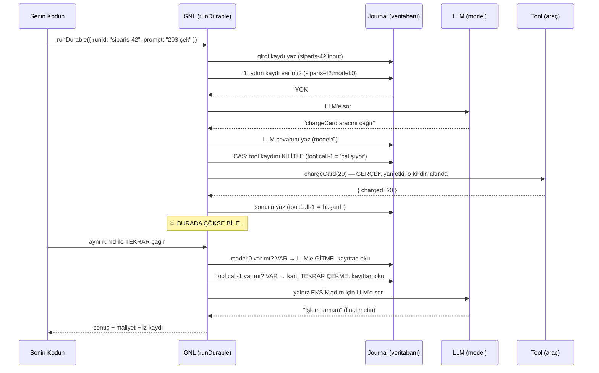
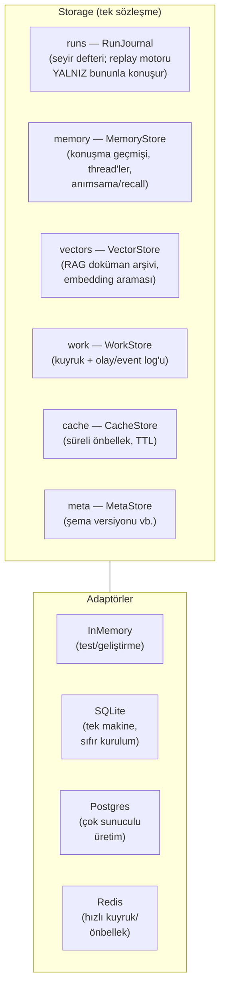
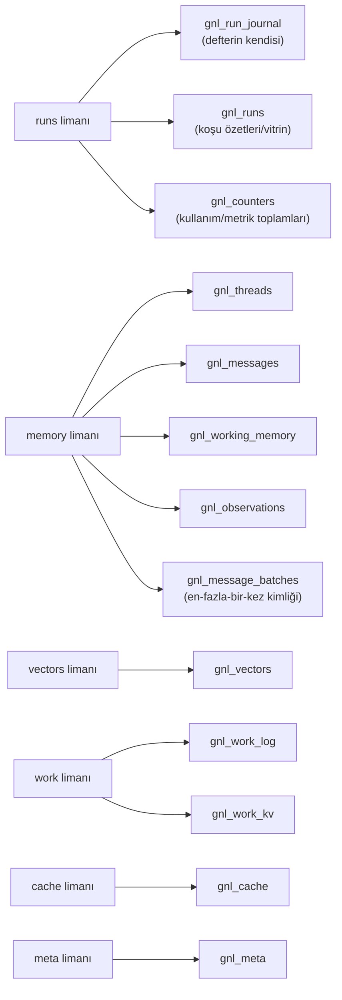
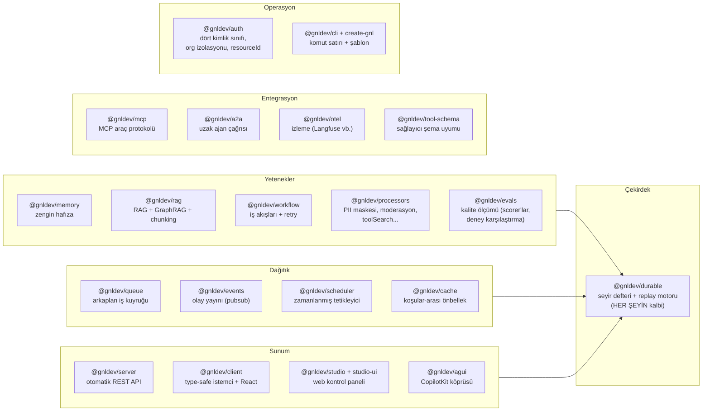
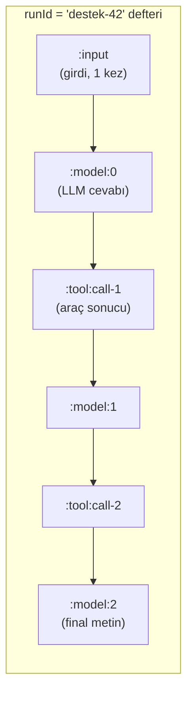
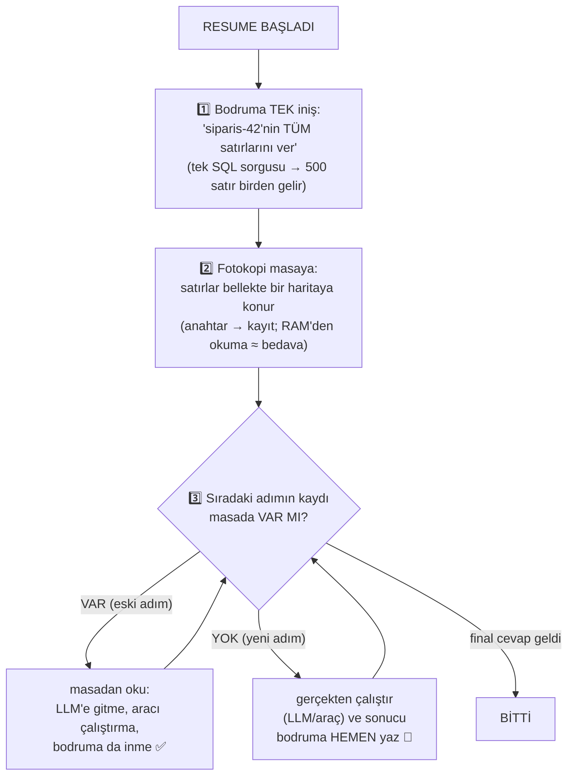
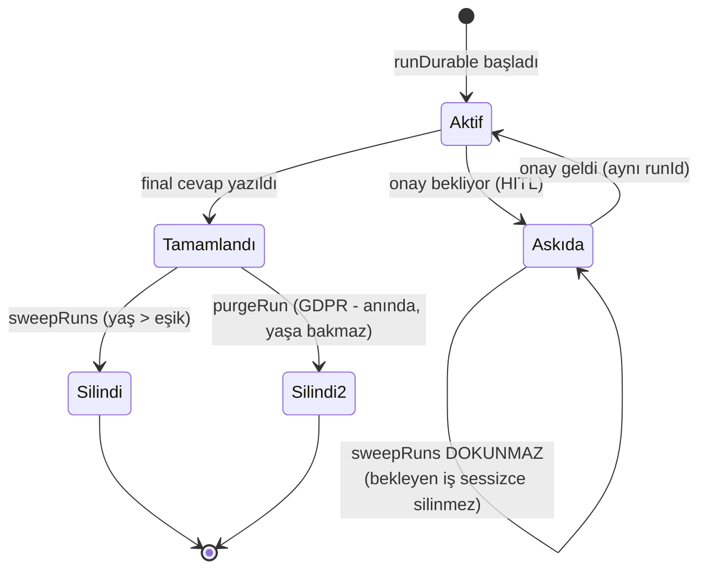
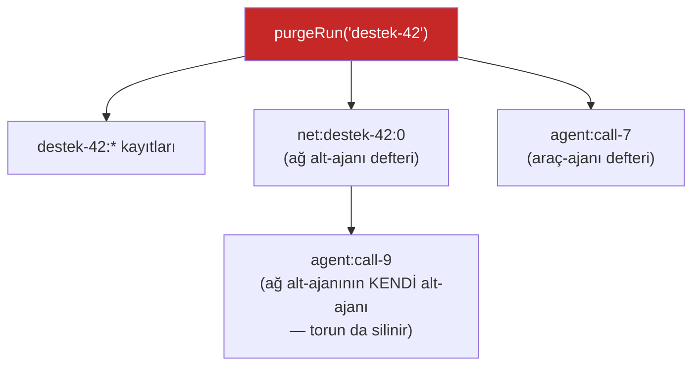
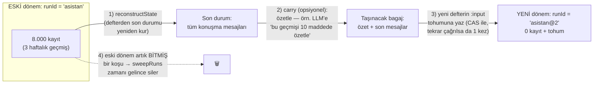
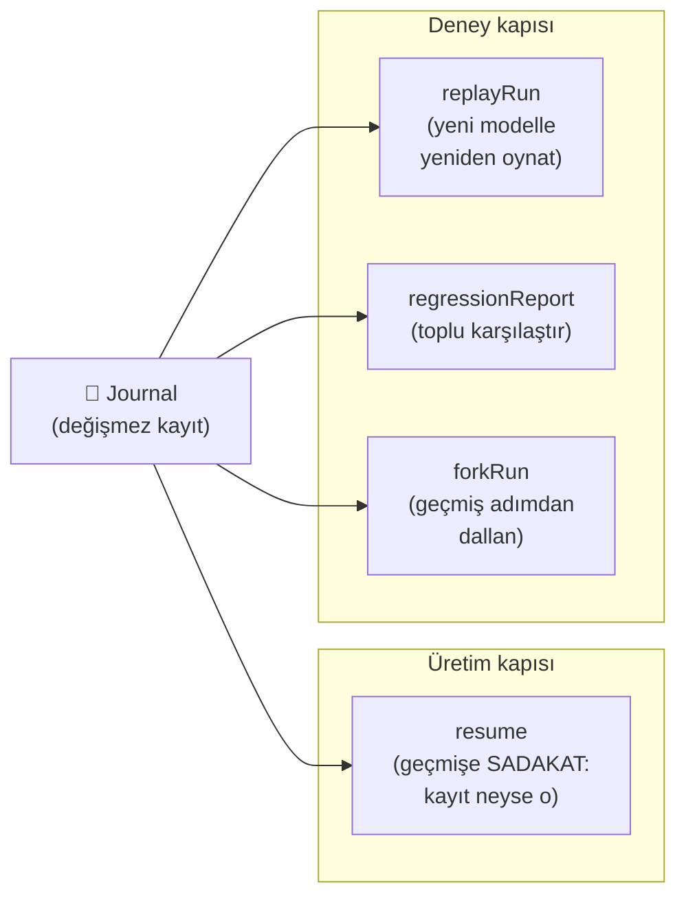

# gnl — Tam Rehber: Nedir, Nasıl Çalışır, Neden Farklı?

> Bu belge GNL'i **hiç bilmeyen birine** anlatmak için yazıldı. Teknik terimler ilk geçtikleri
> yerde parantez içinde açıklanır. Şemalar Mermaid formatındadır (GitHub/VS Code otomatik çizer).

---

## 1. GNL nedir? (tek paragraf)

GNL, **yapay zekâ ajanları** (agent: bir LLM'in — yani ChatGPT benzeri bir dil modelinin — araçlar
kullanarak çok adımlı iş yapan hali) inşa etmek için bir TypeScript framework'üdür (framework:
uygulamanın iskeletini hazır veren kod kütüphanesi seti). Diğer agent framework'lerinden
temel farkı şudur: **GNL'de her ajan koşusu bir "seyir defterine" yazılır ve bu sayede elektrik
kesilse, sunucu çökse, işlem yarıda kalsa bile ajan kaldığı yerden devam eder — ve para çeken,
e-posta atan gibi geri alınamaz işlemler ASLA iki kez çalışmaz.**

---

## 2. Çözdüğü problem: "Ajan yarıda ölürse ne olur?"

Bir ajan düşün: müşterinin kartından 20$ çekiyor, sonra fatura e-postası atıyor, sonra CRM'e
(müşteri kayıt sistemi) not düşüyor. Üç adım, üç **yan etki** (side effect: dış dünyayı değiştiren,
geri alınamaz işlem).

Senaryo: Kart çekildi ✅ → e-posta atıldı ✅ → tam CRM'e yazarken **sunucu çöktü** 💥.

Şimdi ne yapacaksın?

- **Baştan çalıştırırsan:** kart İKİNCİ kez çekilir, e-posta İKİNCİ kez gider. Felaket.
- **Hiç çalıştırmazsan:** CRM notu eksik kalır. İş yarım.

Çoğu framework bu soruna tam bir cevap vermez. GNL'in cevabı:

```
Ajanı AYNI runId ile tekrar çalıştır.
→ Kart çekimi: seyir defterinde kayıtlı → ATLANIR (tekrar çekilmez, kayıtlı sonuç kullanılır)
→ E-posta:     seyir defterinde kayıtlı → ATLANIR
→ CRM notu:    kayıtlı DEĞİL → şimdi çalışır ✅
```

Buna **deterministic replay** (deterministik tekrar-oynatma: aynı
koşu tekrar edildiğinde LLM'e ve araçlara yeniden gitmeden, defterdeki kayıtlardan aynı sonucun
yeniden kurulması) denir.

### Yukarıdaki cümlenin sessizce atladığı durum

Yukarıdaki çöküş adımlar *arasında* oluyor — kolay yarısı bu. Zor yarısı bir adımın **içinde** olan
çöküş: CRM yazması gitmiş, ve süreç sonucu deftere ulaşmadan ölmüş. Devam etme artık
sınıflandıramadığı bir adımla karşı karşıya: olmuş olabilir, olmamış da olabilir.

GNL iki yönden hiçbirine tahmin yürütmez. Yan etkisi olan bir araç için **durur ve sorar**,
`SideEffectRetryBlockedError` fırlatarak:

```ts
import { SideEffectRetryBlockedError } from '@gnldev/durable';

try {
  await runDurable({ runId: 'order-42', journal, model, tools, prompt });
} catch (e) {
  if (!(e instanceof SideEffectRetryBlockedError)) throw e;
  // e.detail.key şüphede olan çağrıyı adlandırır. Üç yoldan biriyle çözülür:
  //   1. tool.recover()  — sağlayıcıyı yeniden sor; {done:true, output} ya da {done:false} döner
  //   2. tool.idempotent: true — tekrarlanması güvenli, o hâlde tekrarla
  //   3. approvals: { [toolCallId]: true } — bir insan karar verdi
}
```

Yani garantinin dürüst adı **at-most-once** (en-fazla-bir-kez): bir yan etki asla iki kez çalışmaz, ve
framework'ün ayırt edemediği yerde riske girmek yerine durur. Bu bilinçli bir takas — kusursuzluk
yerine doğruluk — ve devam etmenin her zaman görünmez olmamasının sebebi budur. **GNL'in "moat"u**
(hendek: aynı tasarım bahsine girmeden kopyalanması zor, yapısal üstünlük) budur.

Aksini söylemedikçe her araç yan etkili sayılır (`durable-tool.ts`:
`tool.sideEffect ?? tool.idempotent !== true`), yani bu istisnai bir durum değil, varsayılan yol.

---

## 3. Temel kavram sözlüğü

| Terim | Açıklama |
|---|---|
| **LLM** | Büyük dil modeli — GPT, Claude, Gemini gibi metin üreten yapay zekâ. |
| **Agent (ajan)** | LLM + araçlar + döngü: model "şu aracı çağır" der, sonuç modele döner, model devam eder — cevap bitene kadar. |
| **Tool (araç)** | Ajanın çağırabildiği fonksiyon: hava durumu API'si, veritabanı sorgusu, kart çekme... |
| **Run (koşu)** | Bir ajanın tek bir görevi baştan sona işlemesi. Her koşunun benzersiz bir `runId` kimliği vardır. |
| **Journal (seyir defteri)** | GNL'in kalbi: koşudaki HER LLM cevabı ve HER araç sonucu, anahtar-değer (key-value) olarak veritabanına yazılır. Yalnızca EKLEME yapılır, değiştirilmez (append-only). |
| **Replay (tekrar oynatma)** | Aynı `runId` ile tekrar çağrıldığında GNL defteri okur: kayıtlı adımlar çalıştırılmadan kayıttan döner, yalnız eksik adımlar gerçekten koşar. |
| **Resume (devam etme)** | Çökme/kesinti sonrası koşuyu aynı `runId` ile yeniden başlatmak — replay sayesinde kaldığı yerden sürer. |
| **CAS** | Compare-And-Set (karşılaştır-ve-yaz): "bu anahtar BOŞSA yaz, doluysa dokunma" işleminin veritabanı motorunda TEK atomik adımda yapılması. İki sunucu aynı anda yazmaya kalksa bile yalnız BİRİ kazanır. At-most-once garantisinin teknik temeli. |
| **Idempotent (tekrar-güvenli)** | Bir işlemin 1 kez de 10 kez de çağrılsa aynı sonucu üretmesi (örn. "bu id ile kayıt varsa yenisini açma"). |
| **HITL** | Human-in-the-loop (döngüde insan): ajan riskli bir işlemden önce durup insan onayı bekler. |
| **RAG** | Retrieval-Augmented Generation (getirmeli üretim): soruyla ilgili dokümanları önce bir arşivden bulup LLM'e bağlam olarak verme tekniği. |
| **Embedding (gömme vektörü)** | Metnin anlamını temsil eden sayı dizisi; iki metnin "anlamca yakınlığı" bu sayılarla ölçülür. |
| **Workflow (iş akışı)** | Ajan serbest döngüsünün aksine, adımları senin belirlediğin sıralı/dallı süreç (adım 1 → koşula göre adım 2a veya 2b → ...). |
| **workKey (iş adı)** | Bir İŞE senin verdiğin ad — koşu id'sini motor bu addan türetir. Konuşma kimliği değildir (o `threadId`'dir). Bkz. §7.2b. |
| **Multi-tenant (çok kiracılı)** | Tek kurulumda birden çok müşterinin verisinin/bütçesinin birbirinden yalıtılması. |

---

## 4. Bir koşu adım adım nasıl işler?



Kritik ayrıntılar:

1. **Araç çağrısından ÖNCE kilit yazılır** (CAS ile `'running'` işareti): iki sunucu aynı koşuyu
   aynı anda işlese bile aracı yalnız biri çalıştırabilir — kart asla iki kez çekilmez.
   Bu, canlı testlerle kanıtlı (aşağıda "Kanıtlar" bölümü).
2. **LLM cevapları da deftere yazılır**: resume'da LLM'e yeniden gidilmez → hem aynı karar
   korunur (determinizm) hem token parası (LLM kullanım ücreti) tekrar ödenmez.
3. **Onay (HITL)**: bir araç `guard` (bekçi: hangi aracın onay istediğini söyleyen kural) ile
   işaretliyse koşu orada ASKIYA alınır; insan onayı geldiğinde aynı `runId` ile devam eder.

---

## 5. Veritabanı yapısı — "seyir defteri" içeride nasıl görünür?

### 5.1 Anahtar şeması (her kayıt bir anahtar-değer çifti)

| Anahtar | İçerik |
|---|---|
| `<runId>:input` | Koşunun girdisi (soru/mesajlar/sistem talimatı) — resume kendi kendine yetsin diye. |
| `<runId>:model:<N>` | N'inci LLM cevabı (metin + araç-çağrısı talepleri + token sayıları). |
| `<runId>:tool:<çağrıId>` | Bir araç çağrısının durumu: `running` → `succeeded/failed/denied/suspended` + çıktı. |
| `<runId>:cfg:model` | Model yedek zincirinde (fallback: birincil model çökerse yedeğe geçme) KAZANAN model — koşu boyunca aynı modele "yapışır". |
| `<runId>:proc:<ad>` | Deterministik olmayan ara kararların (LLM'li moderasyon, skorlama...) dondurulmuş sonucu. |
| `<runId>:wf:<adımId>` | Workflow adım çıktıları. |
| `<runId>:net:route:<i>` / `net:step:<i>` | Dinamik ajan ağında (aşağıda) yönlendirici kararları + adım sonuçları. |
| `<runId>:lock` | Koşu kilidi (aynı koşuyu iki sunucunun aynı anda işlemesini önler). |
| `agent:<çağrıId>` / `net:<runId>:<i>` | Alt-ajanların KENDİ defterleri (her alt-ajan tam teşekküllü bir koşudur). |

### 5.2 Depolama mimarisi: 6 "liman" (port), 4 adaptör

GNL veritabanına doğrudan bağlanmaz; **Storage** adlı soyut bir arayüz (interface: "şu fonksiyonlar
olacak" sözleşmesi) üzerinden konuşur. Bu arayüz 6 limana ayrılır:



Her adaptör her limanı desteklemek ZORUNDA değil — **capability matrix** (yetenek matrisi) dürüstçe
ne verebildiğini söyler ve `composite()` (birleştirici) ile limanlar farklı motorlara dağıtılır:

```ts
// Örnek: koşu defteri Postgres'te (dayanıklılık), kuyruk+önbellek Redis'te (hız):
const storage = composite({
  default: new PostgresStorage({ connectionString: PG_URL }),
  overrides: { work: redis, cache: redis }, // redis = new RedisStorage({...})
});
```

| Adaptör | runs (defter) | memory | vectors | work | cache | Ne zaman? |
|---|---|---|---|---|---|---|
| InMemory | ✅ | ✅ | ✅ | ✅ | ✅ | Test, prototip. |
| SQLite | ✅ | ✅ | ✅ (tarama) | ✅ | ✅ | Tek makine, sıfır kurulum (Node'a gömülü). |
| Postgres | ✅ | ✅ | ✅ (tarama) | ✅ | ✅ | Çok sunuculu üretim. **Önerilen defter.** |
| Redis | ✅* | ❌ | ❌ | ✅ | ✅ (gerçek TTL) | Kuyruk/önbellek hızlandırıcı. *Defter için failover'lı kurulumda önerilmez (aşağıda). |

Hücreler adaptörlerin kendi `capabilities` matrisinin birebir aktarımı (`postgres-storage.ts`,
`sqlite-storage.ts`, `redis-storage.ts`, `in-memory-storage.ts`).

> **`scan` (tarama), pgvector değil.** SQLite *ve* Postgres adaptörlerinin `vectors` limanı
> embedding'i TEXT kolonda tutar ve kosinüs benzerliğini **JavaScript'te, uygun tüm satırlar
> üzerinde** hesaplar — `@gnldev/durable` içinde hiçbir yerde `CREATE EXTENSION vector` yok, ANN
> index'i de yok. Mütevazı bir arşiv için yeterli ve ne olduğu konusunda dürüst. **pgvector başka
> bir pakette**: `@gnldev/rag`'deki `PostgresVectorStore`
> (`packages/rag/src/postgres-vector-store.ts`) eklentiyi kurar, `embedding vector(dim)` kolonu
> tanımlar ve sıralamayı motor içinde `<=>` operatörüyle yapar. Arşiv büyükse — depolama
> adaptörünün `vectors` limanını değil — onu kullanın.

### 5.3 Somut tablo yapıları — hangi tablo ne için, ne zaman kullanılır?

SQLite ve Postgres adaptörleri ilk açılışta AYNI adlarla **13 tablo** kurar (`init()` — idempotent:
tablo varsa dokunmaz). Limanların tablolara dağılımı:



**① `gnl_run_journal` — seyir defterinin kendisi (en önemli tablo).**

| Kolon | Ne işe yarar? |
|---|---|
| `key` | §5.1'deki anahtar (örn. `siparis-42:model:0`) — birincil anahtar (primary key: satırı benzersiz kılan kolon; aynı anahtar İKİNCİ kez EKLENEMEZ — CAS bu kısıta yaslanır). |
| `run_id` | Hangi koşuya ait (anahtardan çıkarılıp ayrıca yazılır — "bu koşunun tüm satırları" sorgusu index'le hızlı olsun diye). |
| `kind` | Satır türü: `model` (LLM cevabı) mı `tool` (araç sonucu) mu. |
| `value` | Kaydın kendisi — JSON metni (superjson: Date gibi tipleri de koruyan JSON türevi). |
| `suspended` | "Bu satır onay bekleyen bir araç mı?" işareti — onay kuyruğu ekranı koca değeri açmadan bulabilsin diye önceden çıkarılmış. |
| `created_at` | Yazılma zamanı (milisaniye) — replay'de satırların SIRASI buna göre kurulur. |

*Ne zaman?* Her LLM/araç adımında 1 satır YAZILIR; resume başında koşunun tüm satırları TEK
sorguyla OKUNUR (bkz. §11.2). Atomiklik doğrudan SQL'dedir: `INSERT ... ON CONFLICT DO NOTHING`
("varsa ekleme" — iki sunucu aynı anahtarı yazarsa motor yalnız birine izin verir = CAS).

**② `gnl_runs` — koşuların vitrini.** Kolonlar: `run_id, model_steps (kaç LLM adımı),
tool_calls (kaç araç), suspended (askıda mı), created_at/updated_at`. *Neden var?* Studio'nun
"Koşular" listesi için: 10.000 koşuyu listelemek için milyonlarca defter satırını taramak yerine
koşu başına 1 özet satır okunur. Her defter yazımında otomatik güncellenir (türetilmiş veridir —
bozulsa bile defterden yeniden hesaplanabilir).

**③ `gnl_threads` — konuşma başlıkları.** Kolonlar: `id, resource_id (hangi KULLANICININ
konuşması — çok kullanıcılı ayrım), title, parent_thread_id (bir konuşmadan dallanan konuşma),
metadata, created/updated_at, deleted_at (silindi işareti)`. *Ne zaman?* Hafızayı (`threadId`)
kullanıyorsan; kullanıcının konuşma listesi ekranı buradan gelir.

**④ `gnl_messages` — konuşma mesajları, mesaj başına 1 satır.** Kolonlar: `thread_id + seq
(konuşmadaki konum — DEPO atar, satırları yazdığı transaction'ın içinde, thread bazında
serileştirerek: aynı thread'e aynı anda ekleyen iki koşu da yazar, biri diğerinin ardına, hiçbiri
kaybolmaz), role (user/assistant), text (aranabilir düz metin), embedding (anlamsal arama vektörü —
"recall" bununla yapılır), ts (zaman), message (mesajın ham/tam hali)`. `(thread_id, seq)` birincil
anahtardır — ama bu bir *replay* güvencesidir, eşzamanlılık güvencesi değil: bilinen konumları
yeniden üreten bir çağıran (`cloneThread`, transkript içe aktarma) aynı satırı iki kez yazsa tek
kopya kalır. Yazımdan ÖNCE çağıranın hesapladığı bir konum tanımı gereği bayattır; konumu artık
çağıran hesaplamıyor. *Ne zaman?* Kullanıcının mesajı ilk model çağrısından önce, üretilen mesajlar
tamamlanınca yazılır (§7.3); sonraki koşularda geçmiş buradan yüklenir, anlamsal anımsama burada arar.

**⑤ `gnl_working_memory` — ajanın "çalışma notu".** Konuşma/kullanıcı başına TEK satır
(`scope_id → data`): ajanın kendine tuttuğu güncel özet ("müşterinin adı Ali, siparişi #42...").
Defterin aksine ÜZERİNE YAZILIR — çünkü bu bir kayıt değil, güncel durum notudur.

**⑥ `gnl_observations` — damıtılmış gözlemler.** Ajanın konuşmalardan çıkardığı kalıcı notlar
("kullanıcı resmi dil tercih ediyor"). Thread başına tek satır, içinde gözlem listesi.

**⑦ `gnl_vectors` — RAG doküman arşivi.** Kolonlar: `id (parça kimliği, örn. 'el-kitabi#3'),
text (parçanın metni), embedding (anlam vektörü, TEXT olarak saklanır), metadata (kaynak/başlık
izi), namespace (organizasyon bölümü), created_at`. *Ne zaman?* `indexDocuments` ile doldurulur;
ajan bilgi-bankası aracını her kullandığında "soruya en yakın K parça" burada aranır. Arama bir
**taramadır**: uygun satırlar geri gelir, kosinüs benzerliği JavaScript'te hesaplanır. Bu tablo bir
pgvector tablosu değil ve olmayacak — motor içi ANN araması için `@gnldev/rag`'in
`PostgresVectorStore`'unu kullanın; onun kendi `vector(dim)` tablosu var (bkz. §5.2).

**⑧ `gnl_work_log` — kuyruk/olay defteri.** Kolonlar: `ns (namespace — hangi kuyruk/konu,
örn. 'evt:siparis'), id (kayıt kimliği; ns+id birincil anahtar → aynı olay iki kez EKLENEMEZ =
idempotent yayın), payload (içerik), ts`. *Ne zaman?* `@gnldev/queue` iş ekleyince, `@gnldev/events`
olay yayınlayınca. Yalnız-ekle çalışır — ve **framework'te onu budayan hiçbir şey yok**. `sweepLog`
budamaz: o bir `Journal` alır ve `appendLog` tabanlı namespace'leri (örneğin denetim defterini)
süpürür; bu tabloya sahip olan `WorkStore` ise bambaşka bir depodur. `WorkStore` arayüzünde hiçbir
silme operasyonu yoktur, yani bir kuyruk ya da konu sınırsız büyür. Elde olan bir süpürge değil, bir
tavandır: `emit(..., { maxDepth })`, konu verilen derinliğe ulaşınca yayını reddeder. Satırları geri
kazanmak operatörün işidir (tabloya doğrudan `DELETE`).

**⑨ `gnl_work_kv` — kuyruk yönetim notları.** Serbest anahtar-değer: işlerin durumu, zamanlayıcı
tanımları ve en önemlisi **teslim işaretleri** (ack marker: "X olayını Y tüketicisi aldı" —
CAS ile yazılır → aynı olay aynı tüketiciye İKİ KEZ teslim edilemez). `@gnldev/events`'in burada
tuttuğu anahtar aileleri: `evtack:` (teslim işaretinin kendisi), `evtcursor:` (her tüketicinin
okuma konumu), `evtatt:` (başarısız denemeler + bir sonrakinin ne zaman geleceği), `evtdead:`
(`listDeadEvents`'in arkasındaki ölü-mektup kaydı) ve `evtrescan:` (`retryDeadEvent`'in yazdığı,
bir sonraki yoklamanın defterin başından yeniden taramasını sağlayan bayrak). Hepsi konu **ve**
tüketici adı başınadır.

**Bu anahtarların parçaları kaçışlanır; yukarıdaki `DELETE`'i elle yazdığınız anda önemi ortaya
çıkar.** `:` hem ayraç hem de konu adında, tüketici adında ve olay kimliğinde gayet olağan bir
karakter, o yüzden her parça birleştirilmeden önce yeniden yazılır: `:` → `%3A`, `%` → `%25`.
`refunds` konusundaki `billing:eu` adlı tüketici bu yüzden `evtack:refunds:billing%3Aeu:<id>`
altında durur; `LIKE 'evtack:refunds:billing:eu:%'` hiçbir şey bulmaz. Aynı kaçışlama ⑧'deki defter
ad alanına da uzanır: `orders:eu` konusu `gnl_work_log.ns = 'evt:orders%3Aeu'` olarak durur. Bu bir
düzen kaygısı değil — `WorkStore.list(ns)` burada tam-değer eşleşmesidir, ama Redis adaptörü ad
alanından bir anahtar türetiyor ve onu önek taramasıyla geri okuyordu; bu da bir konuya başka bir
konunun olaylarını teslim ediyordu.

**⑩ `gnl_cache` — süreli önbellek.** `key, value, expires_at (son kullanma zamanı)`. Koşular
ARASI tekrar kullanım için (örn. aynı metnin embedding'i iki koşuda → bir kez hesapla).
Süresi geçen kayıt okunmaz ve temizlenir.

**⑪ `gnl_meta` — sistem künyesi.** `k → v` (örn. `schema_version = 3`): adaptör açılışta bakar,
tablo şeması eski sürümden kalmaysa güvenli göç (migration) kararını buradan verir.

**⑫ `gnl_counters` — toplanabilir sayaçlar.** Kolonlar: `key, field, value` (`(key, field)` birincil
anahtar). Atomik `INSERT ... ON CONFLICT DO UPDATE SET value = value + EXCLUDED.value` ile yazılır;
birden çok süreçten aynı anda artırmayı güvenli kılan da bu. *Ne zaman?* Maliyet/kullanım defterleri
ve metrikler (`incrBy` — bkz. `metrics.ts`), Studio'nun okuduğu organizasyon başına bütçe toplamları
dahil. `gnl_runs` gibi türetilmiş veridir ve aynı retention yolundan süpürülür (`deletePrefix` bunu
da kapsar — `retention.ts`).

**⑬ `gnl_message_batches` — bir mesaj öbeğinin en-fazla-bir-kez kimliği.** Kolonlar:
`thread_id, batch_key, seq_from, seq_to, ts` (`(thread_id, batch_key)` birincil anahtar). ② ve
⑫'nin aksine türetilmiş veri **değildir**: `appendMessagesOnce` anahtarı
`INSERT ... ON CONFLICT DO NOTHING` ile, **satırları yazan transaction'ın İÇİNDE** claim eder; claim
kaybederse "bu öbek zaten yazılmış" demektir ve mesajlara dokunulmaz — ikisi hiçbir zaman birbirini
yalanlayamaz. `seq_from/seq_to` öbeğin kapladığı aralığı tutar; `deleteMessagesAfter` böylece silme
sınırının ötesinde biten öbeklerin işaretlerini de temizleyebilir, yoksa yeniden üretilen bir tur
"zaten uygulanmış" görünürdü. *Ne zaman?* Koşunun yaptığı her hafıza eklemesinde — öbek başına 1
satır; aynı öbeğin tekrarı satırı zaten orada bulur ve durur.

> Akılda kalsın diye: **① defter, ② vitrin, ③-⑥ hafıza, ⑦ kütüphane, ⑧-⑨ postane, ⑩ buzdolabı,
> ⑪ künye, ⑫ çetele, ⑬ yırtılmış bilet koçanı.** Kritik garanti ①'de — mesaj eklemeleri için de
> ⑬'te — yaşar; gerisi konfor/hız katmanlarıdır ve `composite()` ile başka motorlara taşınabilir.

---

## 6. Paket haritası — 25 paket, 6 grup



Harita bu altı gruba giren 22 paketi gösteriyor. `packages/` altında grubu olmayan üç paket daha
var: `@gnldev/chat-adapter`, `@gnldev/docs-mcp` ve `@gnldev/semantic-qualify` — bir yargıç
closure'ının `@gnldev/durable` onu koşturmadan önce geçmesi gereken sınav (aynı fixture'larda aynı
prompt ile bir model %43, başka bir model %100 paraphrase recall verdi; bu yüzden runtime
sertifikasız yargıcı config anında reddediyor). Yani `packages/` altında 25 manifest var ve hepsi
npm'e çıkıyor.

Kilit nokta: **her paket `@gnldev/durable`ın üstüne kurulur** — RAG sorgusu da, kuyruk işi de, uzak
ajan çağrısı da otomatik olarak deftere yazılır ve aynı
[at-most-once](../packages/durable/README.md#what-never-charged-twice-actually-means) garantisini MİRAS alır. Başka yerlerde
bu özellikler ayrı ayrı vardır ama ortak bir dayanıklılık zemini yoktur.

---

## 7. Tam kullanım senaryosu — sıfırdan üretime

### 7.1 İlk ajan (5 dakika)

```ts
import { createGnl, InMemoryJournal } from '@gnldev/durable';
import { openai } from '@ai-sdk/openai';

const gnl = createGnl({
  journal: new InMemoryJournal(),           // prod'da: new SqliteStorage('app.db').runs
  agents: {
    asistan: {
      model: ['openai/gpt-4o', 'anthropic/claude-sonnet-4'], // YEDEK ZİNCİRİ: ilki çökerse ikinci
      system: 'Kısa ve net cevap ver.',      // sistem talimatı (ajanın kişiliği/kuralları)
    },
  },
});

const r = await gnl.run('asistan', { runId: 'soru-1', prompt: 'Merhaba!' });
console.log(r.text);
```

`model`'e dizi verince **deterministik fallback** devreye girer: ilk başarılı model deftere
"dondurulur", koşunun kalanı ve tüm resume'lar AYNI modeli kullanır (birçok diğer framework'te fallback kararı
kalıcı değildir — resume'da farklı model farklı cevap üretebilir).

### 7.2 Araç + insan onayı (HITL)

```ts
const gnl = createGnl({
  journal,
  agents: {
    kasiyer: {
      model: 'openai/gpt-4o',
      tools: {
        chargeCard: tool({
          description: 'kart çekme',
          inputSchema: z.object({ amount: z.number() }),
          execute: async ({ amount }) => ({ charged: amount }),
        }),
      },
      // `guard` bir NESNE değil, FONKSİYON: her araç çağrısını görür ve bir karar döndürür.
      guard: ({ toolName }) =>
        toolName === 'chargeCard' ? { action: 'require-approval' } : { action: 'allow' },
    },
  },
});

const r1 = await gnl.run('kasiyer', {
  workKey: 'odeme-7',                           // İŞE verdiğin ad — konuşmaya değil
  resourceId: 'u-142',                          // kimin ödemesi: adın benzersiz olduğu adres
  prompt: '20$ çek',
});
// r1.interrupts → [{ toolCallId: 'call-1', toolName: 'chargeCard', args: {...} }]  → ASKIDA

// ... insan Studio'dan (veya kendi arayüzünden) onayladı ...
const r2 = await gnl.run('kasiyer', {
  workKey: 'odeme-7',                           // AYNI workKey = AYNI İŞ — onay o işe gider,
  resourceId: 'u-142',                          // sohbete tur eklemez
  approvals: { 'call-1': true },
});
// LLM'e yeniden gidilmedi, kart TAM 1 kez çekildi.
```

Buradaki tekrar eden anahtar "bu aynı ödeme" demektir; "konuşmaya devam et" demek değildir. Konuşma
`threadId`'dir, ayrı bir alandır ([§7.3](#73-hafıza-konuşma-geçmişi)). Bir `workKey`'i işi yeniden
denemek ya da sürdürmek için kullan, sohbete tur eklemek için asla. Koşu id'sini motor bu anahtardan
türetir; yani `odeme-7` journal'a kendi başına anahtar olarak hiç girmez.

### 7.2b İş kimliği (`workKey`)

**`workKey`, bir konuşmanın değil, bir İŞİN sizin verdiğiniz adıdır.** Açtığı koşu kaydı yaşadığı
sürece, aynı `workScope` içinde aynı `workKey` ile gelen çağrı ikinci bir koşu başlatmaz; o koşuya
yönlendirilir.

`thread_id`'den geliyorsanız: orada aynı anahtar "devam et" demektir, burada "bu aynı iş" demektir —
yeniden denemek için kullanın, tur eklemek için asla. Konuşma `threadId`'dir, ayrı alandır ve ikisini
aynı anda gönderebilirsiniz.

`workKey` bir iş adıdır (kesilen fatura, yayımlanan belge, 7742'nin yazılım güncellemesi, bu gecenin
mutabakatı); rastgele bir yeniden-deneme jetonu değildir. Hassas veri koymayın — hata gövdelerinde
yansır, Studio ekranlarında görünür.

```ts
const gnl = createGnl({
  journal,
  agents: {
    faturalama: { model, workScope: 'resource' },  // varsayılan: iş bir KİŞİYE aittir
    mutabakat: { model, workScope: 'org' },        // kurulum geneli: gecelik toplu iş
  },
});

await gnl.run('faturalama', {
  workKey: 'fatura-2026-04-7742',   // işin adı
  resourceId: 'u-142',              // adın benzersiz olduğu adres ('resource' kapsamı)
  prompt: 'Nisan faturasını kes',
});
```

Bir çağrıda **ya** `workKey` **ya** `runId` bulunur, ikisi birden asla: tek çağrıya iki kimlik,
motorun ancak tahminle cevaplayabileceği bir sorudur. Ham motor yüzeyi (`runDurable`, `resumeRun`,
`forkRun`, `streamDurable`) her zaman ham id alır — resume ve fork bir hash'i tersine çeviremez.

**İkinci çağrıda ne olur.** İki eksen; v1'de her birinin tek bir davranışı var (bu yüzden ortada
ayarlanacak bir alan da yok), ama adları bugünden sabit:

| Eksen | v1 değeri | İkinci çağrı ne alır |
| --- | --- | --- |
| `onConflict` | `'reject'` | İş **şu an koşuyor** → `409 run_busy` + `Retry-After`. |
| `onReuse` | `'replay'` | İş **bitmiş** → kayıtlı cevap döner, hiçbir şey yeniden koşmaz. |

**`run_busy`'yi mümkün kılan şey bir kilit, ve kilidin bir TTL'i var.** "Şu an koşuyor", journal'ın
içeriğinden çıkarılmıyor: koşum başlamadan alınan ve koşum sürdükçe kalp atışıyla yenilenen koşum
başına bir kilit var (`lock: { ttlMs }`, varsayılan 300 000 ms). Bundan iki sonuç çıkıyor ve ikisi de
garantinin şekli — yanındaki çekinceler değil: kilidi bırakmadan ölen bir süreç koşumu yalnız TTL
dolana kadar tutar, sonrasında yeniden deneme kabul edilir ve journal'dan tekrar oynar; TTL'ini
meşru şekilde aşan bir koşum ise kilidi kalp atışıyla canlı tutar. Yani TTL koşumun uzunluğunu
değil, çökme sonrası kurtarmayı sınırlar.

Ve dipnot değil, madde: **başarısız biten koşunun döndürülecek sonucu yoktur; aynı `workKey`
yeniden koşabilir.** Başarısız işi yeniden denemek normal durumdur, kaçış kapısı değil.

**Bir `workKey` ne kadar benzersiz kalır: koşu kaydı yaşadığı sürece — bir dakika fazlası değil.**
Tanıma, metnin değil saklanan kaydın özelliğidir. Süpürme o koşuyu sildiği an anahtar yeniden
yabancıdır. Yani ayarlanacak sayı "koşuları ne kadar tutayım" değil, bir karşılaştırmadır: **saklama
pencereniz, istemcilerinizin üretebileceği en uzun yeniden denemeden kısa olmamalı.** Bunu garanti
edemiyorsanız mezar taşlarını açın (`tombstones: true` + `tombstonePolicy: 'reject'`): geç deneme,
işi sessizce baştan başlatmak yerine `409 run_swept` ile reddedilir. Mezar taşı bir rettir, cevap
değil — ve içinde anahtarın yalnız **hash**'i durur.

Son bir dürüstlük cümlesi: **`runId`, `workKey`'inizin kararlı bir takma adıdır (pseudonym),
anonimleştirilmesi değildir.** Düşük entropili bir anahtar (`fatura-1`) sözlükle geri çözülür ve
KVKK/GDPR açısından kimliğin statüsü anahtarınkiyle aynı kalır.

### 7.3 Hafıza (konuşma geçmişi)

```ts
import { AgentMemory } from '@gnldev/memory';
import type { Storage } from '@gnldev/durable';
// `memoryFactory`, kayıt katmanına ne verildiyse onu alır — bu düz bir journal de olabilir.
// AgentMemory tam Storage ister (mesajlar + vektörler), bu yüzden bu biçim yukarıdaki `storage`ı
// varsayar, yalnızca-journal bir kurulumu değil.
const gnl = createGnl({ storage, memoryFactory: (s) => new AgentMemory({ storage: s as Storage, embed }) });
await gnl.run('asistan', { runId: 'r1', threadId: 'musteri-5', prompt: 'Adım Ali' });
await gnl.run('asistan', { runId: 'r2', threadId: 'musteri-5', prompt: 'Adım neydi?' }); // "Ali"
```
`threadId` (konuşma ipliği kimliği) aynı olan koşular geçmişi paylaşır; **semantic recall**
(anlamsal anımsama: eski mesajlar arasından soruyla alakalı olanları embedding ile bulup getirme)
ve **working memory** (çalışma notu: ajanın kendine tuttuğu güncel özet) desteklenir.

**Write-ahead kalıcılık.** Kullanıcının mesajı ilk model çağrısından *önce* thread'e yazılır;
asistanın cevabı tamamlanınca eklenir. İlk token gelmeden ölen bir koşu (sağlayıcı kesintisi, kota)
soruyu asla kaybetmez — thread ne sorulduğunu gösterir; retry (aynı `runId` ya da aynı metni yeniden
gönderen yeni bir tane) mesajı çiftlemek yerine deduplicate edilir. Onay için askıya alınan tur da
beklerken sorusunu gösterir.

**İstemci sözleşmesi (yalnız-delta).** Memory açıkken geçmişin sahibi sunucudur: tur başına yalnız
*yeni* mesaj(lar)ı gönderin — tüm transkripti değil. Yine de tam geçmişi POST'layan istemciler
(`useChat` tel formatı böyle yapar) ele alınır: thread'de kayıtlı geçmiş varken isteğin içindeki
assistant/tool mesajları ancak önceki sunucu turlarının ekosu olabilir ve kaydetmeden/prompt'lamadan
önce kırpılır. *Yeni* bir thread'i hazır transkriptle tohumlamak (ilk turda few-shot geçmiş) olduğu
gibi kaydedilmeye devam eder.

**Memory provenance ("model bunu nereden bildi?").** Memory'li her tur, girdisinin yanına bir
`:memctx` kaydı dondurur: semantic recall'un hangi mesajları (benzerlik skorlarıyla) enjekte ettiği,
güncel pencerenin mesajları, working-memory/gözlem enjeksiyonları ve kaç istemci ekosunun
kırpıldığı. Donmuş girdi modelin *ne* gördüğünü söyler; bu kayıt *her parçanın nereden geldiğini* —
`GET /runs/:id/memory-context` ile ya da Studio Inspector'da: Threads → bir konuşma → turun
**memory** satırı. Cevapsız kalan sorular (ilk token'dan önce ölen run) aynı defterde hayalet satır
olarak görünür.

Kayıt ayrıca yalnız bir şey ters gittiğinde beliren iki alan taşır; ikisi de **input processor**'larla
ilgilidir. `incomingUnrecoverable`, processor zinciri turun kurtarılabilir bir kopyasını bırakmadığında
yazılır — yani thread'e cevap kaydedilmiş, soru kaydedilmemiştir; değeri bunun hangi yoldan olduğunu
söyler: `messages-dropped` (zincir hiç `messages` dizisi döndürmedi), `boundary-lost` (tanınabilir
hiçbir şey hayatta kalmadı, geçmişin nerede bitip yeni turun nerede başladığı bilinmiyor) ya da
`turn-dropped` (sınır biliniyor ve zincir turu oradan çıkardı). Processor öncesi mesajlar bilerek
yedek olarak *kullanılmaz* — maskesiz olanlar onlardır — bu yüzden `incomingCount` `0` olur ve koşu
ayrıca `console.warn` ile uyarır; düzeltmek için yeni turu `messages` içinde dizi olarak bırakın.
`incomingDedupedByShape` ise bu turun, kayıtlı olanın kopyası sayılarak **processor sonrası** şekiller
üzerinden düşürüldüğünde yazılır: memory bir kez maskeli soruyu tuttuğunda karşılaştırma ancak maskeli
metin üzerinde yapılabilir, dolayısıyla aynı dizeye maskelenen gerçekten farklı iki soru burada ayırt
edilemez ve ikincisi retry sayılır. Bunun bedeli içerik değil, tur *sayısıdır* — model her iki halde de
aynı tek dizeyi görmüştür.

**Zincirin turunuzun arkasına eklediği satır modele gösterilir, ama saklanmaz** (`chainAppended`).
Kendi mesajını çağıranınkinin arkasına ekleyen bir input processor — bir uyum hatırlatması, bir
`[kırpıldı]` işareti, enjekte edilen bir politika satırı — eskiden o satırı kullanıcının turunun
parçası saydırıp thread'e yazdırıyordu. *Saklandığı* için de geçmiş olarak geri geliyor ve zincir
üstüne bir yenisini ekliyordu: 10 tur boyunca ölçüldü, bellekte 30 mesajın 10'u processor'ın notuydu
(satırların %33'ü) ve model hatırlatmayı 1. turda bir kez, 10. turda **on kez** gördü. Tur artık
çağıranın yazmayı bıraktığı yerde biter; not modele tur başına tam bir kez ulaşır, thread'de ise
yalnız konuşma kalır. `:memctx.incomingCount` hâlâ donmuş girdinin tüm kuyruk bloğunu sayar (regresyon
yeniden koşması bununla kırpar), `chainAppended` ise bunların kaçının zincire ait olduğunu söyler —
"bellekte ne var" = `incomingCount - chainAppended`. Zincir hiçbir şey eklemediyse alan yoktur; input
processor'ı olmayan her koşu böyledir.

**Kontrfaktüel yeniden koşma (çıkarım değil, kanıt).** "Model bunu recall parçasından okumuştur" bir
çıkarımdır — Studio'nun Regression sekmesi bunu deneye çevirir: *hafızasız yeniden koş*, provenance
kaydının enjekte edildiğini kanıtladığı kısmı çıkarıp aynı turu aynı modelle yeniden sorar ve iki
cevabı diff'ler. Provenance kaydı olmayan turda neyi kırpacağını tahmin etmek yerine çalışmayı
reddeder.

### 7.4 RAG — doküman arşivinden cevap

```ts
import { chunkDocuments, indexDocuments, PostgresVectorStore, createRagTool, GraphRag } from '@gnldev/rag';

// 1) Dokümanları parçala (chunk: uzun metni aranabilir küçük parçalara bölme):
const parcalar = chunkDocuments([{ id: 'el-kitabi', text: uzunMetin }], { strategy: 'markdown' });
// 2) Kalıcı vektör arşivine yaz (pgvector: Postgres'in embedding arama eklentisi):
const store = new PostgresVectorStore({ connectionString: PG_URL });
await indexDocuments(store, embed, parcalar);
// 3) Ajana araç olarak ver:
tools: { bilgiBankasi: createRagTool({ store, embed, topK: 4 }) }
```
İnce ayrıntı: RAG sorgusu da deftere yazıldığı için **resume'da arama tekrarlanmaz** — arşive o
arada yeni doküman eklense bile koşu aynı kanıtlarla devam eder (deterministik RAG — nadirdir, çünkü getirme işleminin kendisinin journal'lanmasını gerektirir).
`GraphRag` ise parçalar arası benzerlik grafı kurup **dolaylı ilgili** parçaları da bulur.

### 7.5 Çoklu ajan — statik ve dinamik

```ts
const cfg = {
  // STATİK: ana ajan, alt-ajanları birer araç gibi görür (agent-as-tool).
  agents: {
    yonetici: { model, agents: ['arastirmaci', 'yazar'] },   // agent_arastirmaci, agent_yazar araçları
    arastirmaci: { model, description: 'web araştırması yapar' },
    yazar: { model, description: 'metin kaleme alır' },
  },
  // DİNAMİK AĞ: bir yönlendirici-LLM her turda hangi ajanın çalışacağına KENDİ karar verir.
  networks: {
    destek: { router: 'openai/gpt-4o-mini', agents: ['arastirmaci', 'yazar'], maxIterations: 6 },
  },
};
const sonuc = await gnl.runNetwork('destek', { runId: 'talep-9', task: 'X konusunu araştır ve özetle' });
```
GNL'in farkı: yönlendirme kararları da deftere **CAS ile dondurulur** → resume'da yönlendirici
yeniden çağrılmaz, ağ aynı yolu izler. Alt-ajan onay için askıya alınırsa kesinti yukarı taşınır.
Studio `GET /runs/:id/network` ile ağacın görselini verir.

### 7.6 Workflow — kontrollü süreç + retry

```ts
import { workflow, step, retry } from '@gnldev/workflow';

const wf = workflow<Siparis>()
  .then(retry(step('stokKontrol', kontrolEt), { attempts: 3, backoffMs: 500, fallback: step('manuel', kuyrugaAt) }))
  .branch((s) => s.tutar > 1000, step('mudurOnayi', onayla), step('otoOnay', gecir))
  .foreach((s) => s.kalemler, (kalem) => hazirla(kalem));

await wf.run(siparis, { runId: 'wf-42', journal });
```
Her adım deftere yazılır → süreç ortasında çökerse tamamlanan adımlar atlanır. `retry`'ın deneme
sayacı bile defterdedir: çökme sonrası "3 deneme hakkı" sıfırlanmaz.

### 7.7 Kalite ölçümü (evals)

```ts
import { faithfulness, toxicity, createDatasetsManager } from '@gnldev/evals';

// Koşu-sonu otomatik skor: agents.asistan.scorers = [toxicity({ model: hakem })]
// Deney karşılaştırma:
const m = createDatasetsManager(journal);
await m.runExperiment({ dataset, run: eskiModelle, scorers, experimentId: 'v1' });
await m.runExperiment({ datasetId: dataset.id, run: yeniModelle, scorers, experimentId: 'v2' });
const fark = await m.compare(dataset.id, 'v1', 'v2');  // hangi soruda geriledik, hangisinde iyileştik
```
Suite ortasında çökerse tamamlanan test-case'ler atlanır (**resumable evals** — nadirdir, çünkü eval koşusunun da her koşu gibi journal'lanmasını gerektirir);
LLM-hakem puanları da deftere yazıldığından tekrar koşularda aynı puan döner (para da yanmaz).

### 7.8 Sunucu, istemci, Studio

```ts
// Sunucu: KONFİGÜRASYONU (registry nesnesini değil) otomatik REST API + OpenAPI şemasına çevirir.
import { createRestApi } from '@gnldev/server';
import { serve } from '@hono/node-server';
const api = createRestApi(config);              // createGnl'e verdiğin nesnenin aynısı
serve({ fetch: api.fetch, port: 3000 });        // POST /agents/asistan/run, SSE stream, /metrics...

// İstemci (tarayıcı/React):
import { GnlClient } from '@gnldev/client';
const client = new GnlClient({ baseUrl: 'http://localhost:3000' });
await client.run('asistan', { runId: 'talep-42', prompt: '...' });
// runId isteğe bağlı — vermezsen istemci üretir, yani her yeniden deneme YENİ bir koşu olur ve
// dedup koruması almaz. Yan etkisi olan her çağrıda kendi runId'ni ver.

// Studio: web kontrol paneli — npx @gnldev/studio --db runs.db
// (ya da --config gnl.config.ts; o zaman Playground da açılır. Biri mutlaka gerekir)
// 20 görünüm (route başına bir nav satırı — studio-ui'daki NAV listesi, src/App.tsx): koşu zaman
// çizelgesi, TIME-TRAVEL (geçmiş bir adıma dönüp oradan ÇATALLAMA), onay kuyruğu, maliyet, izler,
// organizasyon/bütçe yönetimi, ağ ağacı, ölü-mektup, playground...
```

### 7.9 Yayınlama (deploy) ve izleme

**Ayrı bir deploy adımı gerekmiyor**, ve bu bilinçli: `createRestApi()` web standardı bir `fetch`
handler'ı döndürüyor, yani onu koşturacak şey platformunuzun zaten beklediği şey. Araya giren bir
adaptör yok, bir sağlayıcının API'siyle ayak uydurması gereken bir şey yok.


```ts
import { createRestApi } from '@gnldev/server';
const api = createRestApi(config);

// Node — fetch handler konuşan hangi sunucuyu isterseniz
import { serve } from '@hono/node-server';
serve({ fetch: api.fetch, port: Number(process.env.PORT ?? 3000) });

// Cloudflare Workers, Deno Deploy, Bun — handler modülün default export'unun kendisi
export default { fetch: api.fetch };
```

```ts
import { exportRunToOtlp, otlpPresets } from '@gnldev/otel';
await exportRunToOtlp(journal, 'siparis-42', otlpPresets.langfuse({ publicKey, secretKey }));
// koşunun tüm izi (trace) tek satırla Langfuse'a (LLM izleme servisi)
```

### 7.9b Kapasite: tek bir Postgres neyi taşır, makine eklemek ne yapar

Tahmin değil, ölçüm. 2,4 GHz'e sabitlenmiş 16 çekirdekli bir makine, Docker'da Postgres, 3 model
adımı ve 2 araç çağrısından oluşan bir ajan turu, trafiğin yarısı SSE üzerinden, 256 eşzamanlı
konuşma, ve her sorguya enjekte edilmiş sabit 3 ms gecikme — uzak bir veritabanını (aynı bölgedeki
Neon/RDS) temsil etmek için:

| dağıtım | istek/s | p50 | p99 |
|---|---:|---:|---:|
| 1 worker | ~19 † | 11,5 sn | 14,8 sn |
| 4 worker | 76 | 3,2 sn | 4,1 sn |
| 8 worker | 119 | 2,1 sn | 2,9 sn |
| 16 worker | ~123 ‡ | — | — |

† Onaylanmadı. 256 eşzamanlı konuşmada tek worker doygunluğun çok ötesinde — verim 5 saniyelik
kovalar arasında %40 civarında dalgalandı ve tezgâhın kararlılık kapısı koşuyu 8 çiftin 8'inde de
eledi. Bu rakam, sunulan yükün ürettiği şeydir; bu dağıtımın taşıyabileceği kapasite değil.

‡ 8'den ayırt edilemiyor. Worker sayısını ikiye katlamak **%3,49** ölçüldü; bu, tezgâhın iki kolu
farklı ilan etmek için aradığı %3,5'lik tabanın altında — 125.000'den fazla istekte sıfır hata. Yük
üretecinin sebep olma ihtimali ayrıca elendi: aynı yük iki istemci sürecine bölününce toplam %3,3
değişti, o da tabanın altında. Buradaki sayı, 8 worker'ın üzerine o çözülemeyen %3,49'un
eklenmesidir; kendi başına bir ölçüm değil.

Onaylanmış basamaklar: **4 → 8 worker 1,43×** (p = 0,0005, 12 çift). Daha hızlı bir sağlayıcıya
karşı (model adımı başına 100 ms) önceki basamaklar **1 → 4: 3,38×** ve **4 → 8: 1,56×** (ikisi de
p = 0,002).

8 worker'da 119 tur/s, tam doygunlukta 24 saatte kabaca **10 milyon ajan turu** demek — pay bırakmak
için bunun yarısına göre planlayın, yani günde yaklaşık **5 milyon**, ya da aynı yarı-doygunluk
noktasında, her biri 30 saniyede bir mesaj atıyorsa **aynı anda ~1.700 kişi**. Yerel veritabanı daha da hızlıdır (bu sayılara hükmeden
çekişme, milisaniye altı gecikmede neredeyse yoktur) — yani geliştirme ortamı bu şekli göstermez.

Plan yapmadan önce bilinmesi gereken üç şey var.

**Bağlantı bütçesi sert bir duvardır ve ona uymak sizin işinizdir.** Her süreç kendi havuzunu açar
— node-postgres varsayılanı 10 bağlantı — ve Postgres `max_connections` kadarına izin verir, tipik
olarak 100. On altı worker bu yüzden 160 ister ve sunucu reddetmeye başlar: daha eski bir turda,
varsayılan 10 bağlantılık havuzla ölçüldü, 600 isteğin 513'ü 500 hatası döndü. (Yukarıdaki tablodaki
16 worker koşusu bütçenin içinde kaldı ve sıfır hata verdi — duvar worker sayısı değil, bağlantı
aritmetiğidir.) Şu sınırın altında kalın:

```
süreç sayısı × havuz boyutu  <  max_connections − 20
```

Kalan pay autovacuum ve superuser oturumları içindir. Daha geniş gitmek için kendi havuzunuzu verin:
`new PostgresStorage({ pool: new Pool({ connectionString, max: 5 }) })`. gnl, pay inceldiğinde kendi
kullandığı miktarı açılışta bildirir; reddedilme durumunda ise Postgres'in yalın
`sorry, too many clients already` cümlesi yerine bu aritmetiği de içeren bir hata gelir.

**Süreç eklemek 8'e kadar işe yarar, sonra durur.** 1 worker'dan 8'e çıkmak verimi kabaca beşe
katlar — 3,38× ardından 1,56×, ikisi de 100 ms'lik sağlayıcıya karşı onaylandı. (300 ms'lik koldaki
1-worker rakamı onaylanmadı, dolayısıyla bu oran yukarıdaki tablodan okunamaz.) 8'den 16'ya çıkmak
ölçülebilir hiçbir şey getirmez.

Tavanın *nerede* olduğu bu turda ölçülmedi: ne CPU boşta oranı ne veritabanı bekleme-olayı örneklendi,
ve iki-istemci testi yalnızca yük üretecini eledi. Paylaşılan veritabanı duran hipotezdir, bulgu
değil. Daha eski bir turda *aynı* veritabanına ikinci bir uygulama grubu eklemenin %32 kattığı
raporlanmıştı — bunu destekler; o rakam yeniden ölçülmedi.

Veritabanı başına 8 worker planlayın. Bundan fazlası başka bir veritabanı demektir — ve bir sonraki
paragraf, bunun neden bir anahtar değil bir proje olduğunu anlatıyor.

**Tek Postgres'in ötesi için bugün bir hikâye yok.** gnl tek bir veritabanı varsayar; günlüğü birden
fazlasına dağıtan bir yönlendirme katmanı yoktur. Bu, konumlanmanın bilinçli bir sonucudur — kendi
veritabanınız, işletilecek altyapı yok — ve bu tasarımın sınırıdır. Büyük bir kiracıyı veritabanlarına
bölmek bir yapılandırma bayrağı değil, gerçek bir projedir; ve organizasyonlar bunun yerine geçmez:
organizasyon bir kiracılık sınırıdır (yalıtım, bütçe, KVKK/GDPR silme), bir bölümleme düğmesi değil.

**Bunların bağlayıcı olup olmaması, çıkarım bedelini kimin ödediğine bağlıdır.** Çıkarımı kiralıyorsanız
— Anthropic, OpenAI, Bedrock — bu tavana varmadan çok önce sağlayıcının hız limitlerine ve günde beş
haneli bir token faturasına çarparsınız; yukarıdaki sayılar sizin için ayrıntıdır. Modeli kendi
GPU'larınızda kendiniz çalıştırıyorsanız, ek token bedavadır, kendi donanımınızdan başka hız limitiniz
yoktur ve çarpacağınız ilk tavan budur. Bu varsayımsal bir kitle de değil: "kendi veritabanınız,
işletilecek altyapı yok" ifadesi, zaten kendi makinelerini çalıştıran bir ekibi tarif eder. Planınızı
bu sayılara göre yapın, teselliye göre değil.

### 7.10 Bakım: temizlik ve uzun ömürlü ajanlar

```ts
await sweepRuns(journal, { olderThanMs: 30 * GUN });   // eski koşuları sil (askıdakiler korunur)
await purgeRun(journal, 'siparis-42');                  // GDPR: bir koşunun TÜM izini sil
                                                        // (alt-ajan defterleri dahil — özyinelemeli)
const { newRunId } = await rolloverRun(journal, 'asistan-ana');  // haftalardır yaşayan ajanın
// defteri büyüdü → durumu yeni bir "döneme" taşı, eski dönemi sonra sil
```

---

## 8. Tasarım ödünleri — GNL ne yapar, neyi bilinçli olarak yapmaz

Her framework karmaşıklık bütçesini bir yere harcar. GNL'inki neredeyse tamamen tek bir şeye gidiyor:
**bir yan etkiyi tekrarlamadan yeniden oynatılabilen, denetlenebilen ve kaldığı yerden sürebilen bir
koşu.** Bu tercih birinci listeyi kazandırıyor, ikincisine mal oluyor.

**Bütçenin aldıkları**

| Yetenek | Pratikte ne demek |
|---|---|
| **At-most-once yan etki** | Tamamlandığı kayda geçmiş bir araç çağrısı ikinci kez çalışmaz — CAS ile zorlanır, iki ayrı işletim sistemi süreciyle ve CI'da gerçek Postgres/Redis'e karşı doğrulanır |
| **Deterministic replay** | Aynı koşu, modele tekrar gitmeden aynı sonuca kurulur — modelin cevabı journal'da, sadece durum değil |
| **Time-travel + fork** | Geçmişteki herhangi bir adıma dönüp oradan dallanma, Studio'da görsel olarak |
| **Model fallback kalıcı** | Gerçekte kazanan model journal'a yazılır; resume zarı yeniden atmaz, ona yapışır |
| **Dinamik ajan ağı kararları donar** | Bir kez verilen yönlendirme kararı kaydedilir, replay aynı yolu izler |
| **Resumable evals** | Test paketi baştan başlamaz, durduğu yerden devam eder |
| **Yönetişim yüzeyi** | Studio 20 görünümle gelir: onay kuyruğu, politika, bütçe, denetim, ölü-mektup, regresyon karşılaştırma |
| **Edge-native** | İnce çekirdek + opsiyonel bağımlılıklar; Workers sınıfı bir bundle'a sığacak kadar küçük |

**Maliyeti — eksiklikten değil, bilinçli olarak**

| Burada yok | Neden |
|---|---|
| Ses (TTS/STT), Slack/WhatsApp kanalları | Kapsam dışı. Bunlar entegrasyon yüzeyi, dayanıklılık değil; eklemek çekirdeği genişletir ama tek bir koşuyu bile daha güvenli yapmaz. |
| No-code ajan editörü | Tasarım gereği kod-öncelikli. Ajanın davranışı incelenebilir, test edilebilir, sürüm kontrollü kodda durur — görsel editör onu diff'in izleyemediği bir yere taşır. |
| Geniş depolama adaptörü kataloğu | Dört tane, artı composite karışımı. Her adaptörün at-most-once garantisini gerçek bir motora karşı kanıtlaması gerekir ve bu kanıt pahalıdır; yük altında hiç yarıştırılmamış uzun bir adaptör listesi özellik değil, yükümlülüktür. |
| Geniş hazır scorer kataloğu | On altı tane — 8 LLM-hakem, 4 modelsiz metin, 3 kural-tabanlı, artı `embeddingSimilarity` — ve kendinizinkini yazabileceğiniz hakem altyapısı. (`packages/evals/src/index.ts`'te sayabilirsiniz: `scorers.ts` 8, `text-scorers.ts` 4, `scorer.ts` 4 katkı veriyor. Trajectory scorer'ları bunların üstünde ayrı bir aile.) |

İş yükünüz "iki kez çalışırsa felaket" cinsindense — ödeme, finans, hukuk, sağlık, uzun-koşan ve
dağıtık her şey — birinci tablo argümanın tamamıdır. İhtiyacınız hızlı ve çok-kanallı bir demoysa,
ikinci tablo size dürüstçe bunun en kısa yol olmadığını söylüyor.

---

## 9. Kanıtlar — bu iddialar test edildi mi?

Evet; iddiaların çoğu **gerçek motorlarda canlı testlerle** kanıtlı — testlerin kendisi
`packages/durable/test/` altında:

- **Çok-sunucu CAS yarışı:** iki ayrı Postgres bağlantı havuzu aynı anahtara aynı anda yazıyor →
  her seferinde TAM BİR kazanan (20 tur + 10'lu fırtına). Redis'te aynı (SET NX).
- **Canlı failover** (sunucu değişimi): birincil Postgres **SIGKILL ile öldürüldü**, yedek terfi
  ettirildi → 30/30 onaylı yazı korundu, at-most-once garantisi sürdü. (Ön koşul: **senkron replikasyon** —
  `synchronous_commit = on` ve senkron bir standby; asenkron kurulumda bu garanti YOKTUR. Koşulun
  kendisi `docker-compose.failover.yml`'de kurulur ve `packages/durable/test/failover-real.test.ts`
  ile test edilir; README'de bu notu aramayın, orada geçmiyor.)
- **Kilit devralma:** süresi dolmuş kilidi iki sunucu aynı anda devralmaya kalktı → yalnız biri
  kazandı (`putIfMatch` CAS'i; eski sürümde buradaki yarış bulunmuş ve kapatılmıştı).
- **Süreç öldürme testleri:** iki ayrı tat var ve fark önemli. `process-kill.test.ts` ve
  `exactly-once-intersection.test.ts`'te çocuk süreç koşunun ortasında sert çıkıyor
  (`process.exit(1)` — yan etkiden sonra, koşu bitmeden), ebeveyn aynı SQLite dosyasından resume
  ediyor. `sigkill-status.test.ts` bir adım öteye gidiyor: çocuk, model çağrısının ortasında gerçek
  `SIGKILL` ile öldürülüyor — exit handler yok, flush yok — ve ebeveyn koşuyu `completed` değil
  `running` okuyor; write-ahead tasarımının var oluş sebebi tam da bu. (Yukarıdaki failover testi
  ise Postgres'in kendisini SIGKILL'liyor — üçüncü bir durum.)
- Toplam: **5.004 geçen test, 65 atlanan, 548 dosya (5 dosya bütünüyle atlanıyor)** (14 Eyl 2026 ölçümü; elinizdeki commit'in
  rakamı için `npx vitest run`), ayrıca `GNL_INTEGRATION=1` ve `GNL_FAILOVER=1` ile gerçek-altyapı
  paketleri.

---

## 10. Sık sorulacaklar

**"Journal şişmez mi?"** Koşu başına kayıt adım sayısıyla doğrusal büyür. Biten koşular
`sweepRuns` ile silinir; haftalarca yaşayan tek ajan için `rolloverRun` durumu yeni döneme taşır.
Resume, tüm defteri TEK toplu sorguyla okur (adım başına sorgu fırtınası yok — ölçülü, testli).
👉 Bu konunun derin anlatımı: **Bölüm 11**.

**"LLM aynı girdiye farklı cevap verirse determinizm nasıl korunuyor?"** Sır şu: GNL modeli
"deterministikleştirmez", **cevabı kaydeder**. İlk koşuda model ne dediyse defterde odur; replay
o kaydı okur, modele hiç gitmez.

**"Hangi LLM'lerle çalışır?"** Vercel AI SDK üzerine kuruludur → OpenAI, Anthropic, Google,
Mistral... `'sağlayıcı/model'` yazman yeterli; sağlayıcı paketleri ancak kullanılırsa yüklenir.

**"En küçük başlangıç?"** `npm create gnl` → SQLite ile tek dosya kalıcılık, sunucu ve Studio
dahil çalışan iskelet. Postgres/Redis üretime geçerken tek satır `storage` değişikliğidir.

---

## 11. Derin konu: Journal büyümesi, okuma maliyeti ve yaşam döngüsü

> Bu bölüm "defter şişmez mi?" sorusunun tam cevabıdır. Sayılar `test/journal-growth.test.ts`
> karakterizasyon testleriyle (karakterizasyon testi: bir davranışı değiştirmeyip ÖLÇÜP sabitleyen
> test) kanıtlıdır — tahmin değil.

### 11.1 Defter tam olarak ne kadar büyür?

Deftere iki tür satır yazılır: LLM her **konuştuğunda** 1 satır, araç her **çalıştığında** 1 satır.
Kilit gözlem: **her araç kullanımı bir ÇİFT üretir** — önce LLM "şu aracı çağır" der (1 satır),
sonra aracın sonucu yazılır (1 satır). En sonda LLM bir kez daha konuşup final cevabı verir (+1).
2 araçlı bir koşuyu sayarak görelim:

```
Soru: "İstanbul'da hava nasıl, dolar kaç TL?"
1. LLM: "hava aracını çağır"        → satır 1 ┐
2. Araç: hava = güneşli             → satır 2 ┘ 1. çift
3. LLM: "döviz aracını çağır"       → satır 3 ┐
4. Araç: dolar = 40 TL              → satır 4 ┘ 2. çift
5. LLM: "Hava güneşli, dolar 40 TL" → satır 5   FİNAL (+1)
                                      ─────────
 2 araç → 2 çift + 1 final          =  5 satır
 3 araç → 3 çift + 1 final          =  7 satır
10 araç → 10 çift + 1 final         = 21 satır      ← kısaltması: "2K+1"
```

Bunlara ek olarak koşu başında sorunun kendisi (girdi) 1 kez ve kilit/seçilen-model gibi 2-3 küçük
idari not yazılır — bunlar **adım sayısıyla BÜYÜMEZ** (2 araçta da 100 araçta da aynı 3-4 satır),
o yüzden büyüme matematiğinde önemli olan yalnız çiftlerdir. Kayıt boyutu ise LLM'in
ÇIKTISININ uzunluğu kadardır (defter LLM'e giden koca prompt'u değil, dönen CEVABI saklar —
bu bilinçli bir tasarımdır, yoksa her kayıt konuşma geçmişinin tamamını taşırdı).



Yani büyüme **koşu İÇİNDE doğrusaldır** (adım sayısıyla orantılı — ne üstel ne kontrolsüz),
koşular ARASINDA ise koşu sayısıyla orantılıdır. Şişme riski iki ayrı soruya ayrışır ve ikisinin
de ayrı cevabı vardır: **(a)** biten koşular birikir → 11.3, **(b)** tek koşu haftalarca yaşar → 11.4.

### 11.2 Okuma maliyeti: "resume pahalı mı?" — fotokopi benzetmesi

Benzetme: veritabanı bodrumdaki **arşiv odası**, resume eden koşu ise masasında çalışan bir
**memur**. Memurun, yarıda kalmış 500 sayfalık bir dosyayı devralması gerekiyor.

**Kötü yöntem (naif):** memur her sayfaya ihtiyaç duydukça bodruma iner — 500 sayfa = 500 kez
merdiven. Her iniş bir **round-trip**tir (gidiş-dönüş: uygulama ile veritabanı arasında bir ağ
turu, tanesi ~1 milisaniye). 500 tur = yarım saniye SADECE yürümekle geçer.

**GNL'in yöntemi:** memur sabah İLK iş bodruma BİR KEZ iner, dosyanın **tamamının fotokopisini**
çeker, masasına koyar. Gün boyu her sayfaya masadan bakar — bir daha bodruma inmez.



İki incelik:

- **Yazma neden tek tek?** Yeni adımların sonucu masada bekletilmez, her adım biter bitmez arşive
  yazılır — çünkü bir sonraki saniye elektrik kesilirse o adımın kaydı kalıcı olmalı. Okuma toplu,
  **yazma anında**: ikisi farklı işler için optimize edilmiştir.
- **Masa (fotokopi) koşu bitince atılır** — kalıcı gerçek her zaman arşivdir; masa yalnız o
  resume'un hız notudur. İki sunucu aynı anda çalışsa bile birbirlerinin masasını görmez,
  arşivdeki CAS kuralları yine tek kazanan seçer.

Sayılarla aynı şey (testle kanıtlı): resume başına bodrum inişi = **1** (koşu 3 adım da olsa
500 adım da olsa); adım başına ek sorgu = **0**; replay sırasında LLM/araç çağrısı = **0** →
token parası yanmaz, yan etki tekrarlanmaz.

Dürüst sınır: koşu M kez resume edilirse fotokopi M kez çekilir (her seferinde N sayfa kopyalanır).
Dosya BİNLERCE sayfaya ulaşmış VE sık sık devralınıyorsa fotokopinin kendisi yorar — işte o zaman
dosyayı kapatıp yeni klasör açarsın: `rolloverRun` (§11.4).

### 11.3 Biten koşuların yaşam döngüsü: `sweepRuns` + `purgeRun`



- **`sweepRuns({ olderThanMs })`** — süpürücü: son aktivitesi eşikten eski koşuları kalıcı siler.
  Güvenlik varsayılanları: **askıdaki** (onay bekleyen) koşular ve zaman damgası okunamayan
  kayıtlar SİLİNMEZ — "bekleyen işi çöpe atma" ilkesi. Bunu bir cron'a (zamanlanmış görev)
  bağlarsın; `@gnldev/scheduler` ile GNL'in kendi içinden de kurulabilir.
- **`purgeRun(runId)`** — nokta atışı silme (GDPR "unutulma hakkı" için): koşunun TÜM izini siler
  ve **özyinelemelidir** (özyinelemeli/recursive: çocukları, çocukların çocuklarını da işler) —
  alt-ajan defterleri hangi derinlikte olursa olsun yetim kalmaz:



- Yan defterler de süpürülür — ama yalnız **journal'da** yaşayanlar: `sweepLog` bir `Journal` alır
  ve `appendLog` tabanlı namespace'leri (örneğin denetim defterini) süpürür; `sweepThreads` ise
  journal tabanlı BasicMemory'deki eski konuşma geçmişlerini siler. Bu listede **olmayana** dikkat:
  kuyruk/olay defteri (`gnl_work_log`) `WorkStore`'a aittir, onun arayüzünde hiçbir silme
  operasyonu yoktur, yani framework'te onu budayan hiçbir şey yoktur — bkz. §5.3 ⑧.

- **Bir şey bilerek süpürülmüyor: cross-run dedup anahtarları.** `idempotencyWindow: 'cross-run'`,
  tek işi *"bu argüman daha önce koştu mu?"* sorusunu **sonsuza dek** cevaplamak olan bir `xrun:…`
  kaydı yazar — onu TTL ile süpürmek, tam olarak engellemek için var olduğu duplicate'i sessizce
  yeniden mümkün kılardı. Bedeli açık: koşular arasında dedup ettiğiniz farklı (araç, argüman)
  çiftlerinin sayısıyla depolama büyür ve hiçbir zamanlanmış iş onu geri almaz. `purgeOrganization`
  bunları siler (`org:<id>:` önekinin altındalar), yani organizasyon silme eksiksizdir; yalnızca
  yaşa dayalı bir süpürme yoktur, bilinçli olarak. `'cross-run'`'ı yüksek kardinaliteli bir anahtarda
  kullanıyorsanız, bu büyümeyi keşfetmek yerine baştan boyutlandırın.

### 11.4 Haftalarca yaşayan TEK ajan: `rolloverRun` (dönem devri)

Asıl zor senaryo: bir ajan tek `runId` ile haftalarca yaşıyor (örn. sürekli çalışan bir operasyon
asistanı). Defteri silemezsin (koşu bitmedi), kırpamazsın da — çünkü defter **append-only**dir
(yalnız-ekle: kayıtlar asla değiştirilmez/silinmez; denetlenebilirlik ve time-travel bu söze dayanır).

Çözüm, muhasebecilerin yüzyıllardır yaptığı şeydir: **dönem kapatmak.** Yıl sonunda eski defteri
kapatır, kapanış bakiyesini yeni defterin İLK satırına yazarsın.



Önemli özellikler (hepsi testli):

- **İdempotent**: `rolloverRun`'ı yanlışlıkla iki kez çağırsan da ikinci çağrı yeni dönem AÇMAZ,
  mevcut hedefi döner; özet (`carry`) de bir kez üretilip dondurulur — LLM'li özetleme iki kez
  para yakmaz.
- **Yıkıcı değil**: eski defter olduğu gibi durur (denetim izi korunur); silme kararı ayrıdır ve
  `sweepRuns`'a aittir.
- **Zincirlenebilir**: `asistan` → `asistan@2` → `asistan@3`... her dönem küçük bir defterle başlar,
  resume maliyeti sıfırlanır.
- Devir bağı deftere yazılır (`asistan:rollover → { to: 'asistan@2' }`) — hangi dönemin hangisine
  devrettiği sonradan izlenebilir.

### 11.5 Neden "yerinde kırpma" (in-place compaction) YOK?

Bilinçli bir tasarım kararı: defterdeki kayıtları yerinde silip "özet kayıtla" değiştirmek
(compaction) append-only sözünü bozar. O söz bozulursa üç şey birden ölür: **time-travel**
(geçmiş adıma dönme — kayıt yoksa dönülecek yer yok), **denetlenebilirlik** (audit: "model o gün
gerçekten ne dedi?" sorusunun kanıtı) ve **replay determinizmi** (özet ≠ orijinal; özetten devam
eden koşu farklı davranabilir). Rollover aynı faydayı (küçük aktif defter) bu üç garantiyi
bozmadan verir — eski dönem, silinene KADAR tam kanıt olarak durur.

### 11.6 Özet tablo: ne büyür, neyi sınırlar, hangi araç yönetir?

| Büyüyen şey | Büyüme hızı | Sınırlayan mekanizma |
|---|---|---|
| Bir koşunun defteri | Adım başına 1-2 kayıt (doğrusal) | Koşu biter → `sweepRuns`; bitmiyorsa → `rolloverRun` |
| Koşuların toplamı | Koşu sayısıyla doğrusal | `sweepRuns` (cron'da) + `purgeRun` (GDPR) |
| Kuyruk/olay kayıtları (`gnl_work_log`) | Olay başına 1 kayıt | **Framework'te hiçbir şey** — `WorkStore` arayüzünde silme operasyonu yok. Süpürge değil tavan: `emit(..., { maxDepth })`; satırları geri kazanmak elle `DELETE` (§5.3 ⑧) |
| Journal durable-log namespace'leri (denetim defteri, …) | Ekleme başına 1 kayıt | `sweepLog(journal, ns, …)` |
| Konuşma geçmişleri, journal BasicMemory (`mem:<threadId>:*`) | Mesajlar thread başına tek journal kaydının içinde birikir | `sweepThreads` + `purgeThread` |
| Konuşma geçmişleri, `@gnldev/memory` (`gnl_threads`/`gnl_messages`) | Mesaj başına 1 satır | Bambaşka bir depo — `AgentMemory.deleteThread`; `sweepThreads` oraya ULAŞMAZ |
| Resume okuma maliyeti | Koşu adımıyla doğrusal ama TEK sorguda | replay-cache (§11.2); sık-resume + dev koşuda → rollover |

---

## 12. Derin konu: Crash sırasında kod/model değişirse ne olur?

> Senaryo: koşu yarıda çöktü, sunucu kapalıyken developer modeli/kodu/prompt'u değiştirdi,
> sonra resume edildi. Kısa cevap: **kayıtlı geçmiş dokunulmazdır; değişiklik yalnız
> "bundan sonrasını" etkiler.** Replay, modeli yeniden çalıştırmak değil KAYDI OKUMAKTIR —
> model değişse de kayıt değişmez.

### 12.1 Somut zaman çizelgesi

```
Pazartesi: koşu başladı (model: gpt-4o)
  satır 1: LLM "kartı çek" dedi          → deftere yazıldı
  satır 2: kart çekildi (20$)            → deftere yazıldı
  💥 CRASH

Salı: developer modeli değiştirdi (gpt-4o → claude-sonnet), sunucu açıldı
  aynı runId ile resume:
  satır 1-2: DEFTERDEN okunur → Claude'a HİÇ sorulmaz, kart TEKRAR çekilmez
             (geçmiş, "o gün gpt-4o ne dediyse" olarak sabittir)
  satır 3+:  yeni adımlar → artık yeni yapılandırma devreye girer
```

### 12.2 Değişiklik türüne göre davranış tablosu

| Developer neyi değiştirdi? | Resume'da ne olur? |
|---|---|
| **Modeli** | Kayıtlı adımlar defterden. Yeni adımlar için: koşu başında kazanan model deftere DONDURULUR (`:cfg:model`) — yeni listede o model hâlâ varsa koşu ona yapışır (yarısı gpt-4o yarısı Claude olan koşu oluşmaz); listeden tamamen çıkarıldıysa ancak o zaman yeni zincir denenir. |
| **Prompt / sistem talimatını** | Girdi ilk çağrıda deftere yazılır, İLK-YAZAN-KAZANIR: resume'da farklı prompt versen bile defterdeki orijinal geçerlidir (`resumeRun` girdiyi defterden okur). Koşu, başladığı soruyla biter. |
| **Tool'un kodunu** | Kayıtlı tool çağrıları defterden döner (tool gövdesi yeniden ÇALIŞMAZ — eski kod ne döndürdüyse o). Yeni çağrılar yeni kodla koşar. |
| **Tool'u tamamen sildi** | Kayıtlı çağrılar sorunsuz (defterden). Model YENİ bir adımda artık olmayan aracı çağırmaya kalkarsa normal "araç bulunamadı" hatası — bu framework'ün değil, tasarım değişikliğinin sonucu. |
| **Agent'ın diğer ayarlarını** (maxSteps, guard, alt-agent listesi...) | Kayıtlı kısım sabit; yeni adımlar yeni ayarlarla. |
| **Ağ (network) yönlendiricisini** | Yönlendirme kararları CAS ile donmuştur → resume aynı yolu izler; yeni router eski kararları DEĞİŞTİREMEZ. |

### 12.3 Drift koruması: uyumsuzluk fark edilirse?

Değişiklik, replay sırasında yeniden kurulan konuşmayı kayıtla ÇELİŞTİRECEK kadar büyükse
(örn. tool'a giden argümanlar kayıttakinden farklı üretiliyor — buna **drift**/sapma denir)
GNL'in iki modu vardır:

- **`replay: 'lenient'`** (varsayılan, hoşgörülü): sapan bir **tool argümanı** uyarı basar, koşu
  kayıttaki sonuçla devam eder — "iş dursun istemiyorum" modu. Sapan bir **model isteği** ise burada
  hiç kontrol edilmez.
- **`replay: 'strict'`** (katı): sapan bir **tool argümanı** `DivergenceError` fırlatıp koşuyu
  DURDURUR — "tutarsızlık varsa körlemesine devam etme" modu; para/hukuk işlerinde bunu açarsın.

**Dürüst sınır — iki mod bunu eşit kapsamıyor.** Strict yalnız tool argümanları için katıdır.
Replay edilen bir **model adımı** farklı bir istek üretirse `console.warn` basılır ve koşu devam
eder; strict'te de öyle, asla fırlatmaz. Bu bilinçli ve gerekçesi `durable-model.ts`'in kendi
yorumunda: memory ya da bir input-processor devredeyken `runDurable`'ı aynı ham argümanlarla tekrar
çağırmak meşru olarak farklı bir istek kurar (processor resume'da yeniden çalışmaz), dolayısıyla
oradaki sert hata, sonucu hiç etkileyemeyecek bir farktan ötürü çalışan kodu bozardı — model adımı
zaten her hâlükârda journal'dan replay ediliyor. Yani: `strict` sana tool-argümanı sapmasında sert
duruş, model sapmasında bir log satırı verir. Bayrağı "hiçbir sapma sessiz kalmaz" diye okuduysan,
vaat ettiğinden fazlasını okumuşsun.

### 12.4 "Yeni modelin ne yapacağını GÖRMEK istiyorum" — resume değil, deney araçları

Resume geçmişe sadakat içindir; geçmişle DENEY yapmak ayrı kapıdır:

- **`replayRun(kayıt, { model: yeniModel })`** — kayıtlı koşuyu yeni modele karşı yeniden oynatır:
  yan etkiler ÇALIŞMAZ (tool sonuçları kayıttan verilir), yalnız modelin KARARLARI karşılaştırılır
  → "aynı durumda yeni model farklı mı davranırdı?"
- **`regressionReport`** — bunu toplu yapar: N eski koşuyu yeni modele karşı koşup karar farklarını
  raporlar. Model yükseltmeden önceki güvenlik ağı.
- **`forkRun` (time-travel)** — Studio'dan geçmiş bir adıma dönüp oradan YENİ BİR DAL açarsın;
  orijinal koşu bozulmaz, dal ayrı bir runId olarak yaşar.



Tek cümlelik özet: **resume = geçmişe sadakat (üretim güvenliği), replay/fork = geçmişle deney
(geliştirme aracı).** Kod/model değişikliği ilkini asla bozamaz, ikincisiyle test edilir.

---

## 13. Teknoloji yığını — hangi teknoloji ne işe yarar (ve neden ClickHouse yok?)

| Katman | Teknoloji | Bu projede ne işe yarar? |
|---|---|---|
| Dil / çalışma ortamı | TypeScript + Node.js | Tüm kod TypeScript (tip güvenliği: yanlış veri şekli derlemede yakalanır). Node 22'nin gömülü `node:sqlite`'ı sayesinde SQLite için ek paket bile gerekmez. |
| Monorepo yönetimi | pnpm workspaces | 25 paketi tek depoda tutar (monorepo: çok paketli tek depo); hepsi npm'e çıkar. |
| LLM soyutlaması | **Vercel AI SDK** (`ai`) | En kritik bağımlılık: OpenAI/Anthropic/Google/Mistral'e TEK arayüz. `runDurable` aslında `generateText`'in dayanıklı sarmalayıcısıdır — sağlayıcı kilidi yok. |
| Şema doğrulama | Zod | Araç girdi şemaları (LLM'in araca göndereceği parametrelerin biçim kontrolü). |
| Web çatısı | **Hono** | Server/Studio/auth'un HTTP katmanı. Express yerine Hono: hem Node'da hem edge'de (Cloudflare Workers) aynen çalışır, çok küçüktür — "küçük edge bundle" iddiasının temeli. |
| Depolama | SQLite / PostgreSQL / Redis | §5'teki adaptörler; hepsi OPSİYONEL bağımlılık (kullanmadığın sürücü yüklenmez — lazy import). |
| Serileştirme | superjson | Kayıt→metin çevirimi; düz JSON'dan farkı `Date` gibi tipleri kaybetmemesi. |
| Test | Vitest + pg-mem + Docker | 548 dosyada 5.004 geçen test (14 Eyl 2026); pg-mem = bellek-içi sahte Postgres (hızlı); Docker compose'ları = GERÇEK PG/Redis entegrasyonu + canlı failover senaryosu. |
| Paketleme | — | Gerekmiyor: `createRestApi()` web standardı bir fetch handler döndürüyor, her platform onu zaten kendi yöntemiyle paketliyor. |
| Studio arayüzü | React + TanStack Query + Recharts | Panel ön yüzü: arayüz + veri çekme/önbellek + grafikler. |
| Gözlemlenebilirlik | OTLP/HTTP (elle, ~8KB) | İzleri dış araçlara gönderme; koca OTel SDK yerine elle yazılmış çevirici (ince-kal felsefesi). Canlı mod ayrıca OTel SDK'sını opsiyonel kullanır. |
| Protokoller | MCP · A2A · AG-UI · OpenAPI | Dış araç takma · uzak ajan · CopilotKit köprüsü · makine-okur API şeması. |
| Kimlik | `node:crypto` (jose YOK) | JWT/JWKS imza doğrulaması gömülü kriptoyla — sıfır ek bağımlılık. |

Yığındaki ortak desen: **çekirdek ince kalsın; ağır şeyler opsiyonel/lazy; gömülüsü varsa dışarıdan alma.**

### 13.1 "Neden ClickHouse yok?" — OLTP/OLAP ayrımı ve tercih edilen yol

Dikkat, benzer iki kısaltma FARKLI şeyler: **OLTP** = işlemsel veritabanı türü (Postgres gibi —
tek satırlık atomik işlemlerde usta); **OTLP** = OpenTelemetry Protocol (izleme verisinin evrensel
kablo formatı — "gözlemlenebilirliğin USB fişi"). **ClickHouse** ise bir **OLAP** veritabanıdır
(analitik: milyarlarca satırda "geçen ay hangi model kaç token yaktı?" gibi TOPLU soru sormak
için kolonar depolama; tek satırı atomik güncellemek için değil).

Aynı veri üzerinde iki farklı soru vardır:

- **"ŞU koşuda ne oldu?"** → nokta okuma → OLTP işi → GNL'in journal'ı + Studio (iz, journal'dan
  ANLIK türetilir; ikinci kopya tutulmaz). Journal ClickHouse'a KONAMAZ: CAS yok → at-most-once garantisi çöker.
- **"5 milyon koşuda p95 gecikme trendi?"** → toplu tarama → OLAP işi → GNL bunu OTLP fişiyle
  dış araca devreder (`otlpPresets`). Komik detay: fişi taktığın Langfuse'un kendisi de arkada
  ClickHouse çalıştırır — yani izlerin yine ClickHouse'a varır, sadece onu SEN işletmezsin.

**Diğer yön:** bir framework kendi analitik deposunu ve panosunu da getirebilir — "tek marka"
deneyimi, karşılığında o depoyu işletme yükü sende (ya da yönetilen bir hizmete ödeme). GNL'in bahsi ters yönde: **kritik olan analitik
değil, KAYIT** — kayıt (journal) sende ve eksiksizse, analitiği istediğin araca sonradan bile
dökebilirsin; kaydı eksik tutup panosu güzel olanın geri dönüş şansı yoktur. Studio bu yüzden
salt izleme panosu değil, **operasyon/yönetişim** panosudur (time-travel, onay kuyruğu, regresyon
karşılaştırma, kiracı/bütçe — bunlar adanmış izleme araçlarında yoktur); filo analitiği + alerting
ise bilinçli olarak dışarıya, fişin ucundaki uzmana bırakılır.
